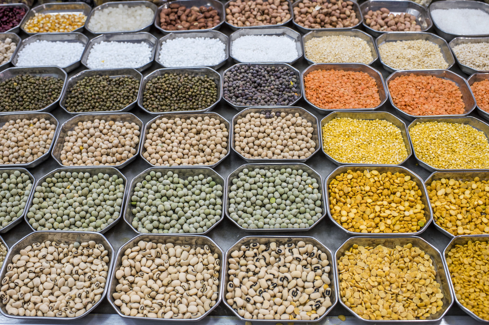

# Summary:

Pulses have been considered an environmentally-friendly and inexpensive alternative to commodities like meat, ideal in helping to combat food insecurity. The FFPI *(*FAO Food Price Index— measure of international food commodity prices) suggests that effects of the COVID-19 pandemic have caused dramatic price surges in all food groups, including pulses, that threaten our ability to feed the growing global population. But is it really just the impacts of the pandemic that threatens this ability?

In order to answer the ultimate question of: *“How did observed pulse prices differ from pre-pandemic price dynamics during COVID-19?”*, I wanted to focus on the price forecasts of this food group in countries most susceptible to food insecurity as determined by the *World Food Programme* (WFP). I examine food price data from the WFP to create time series forecasts via gradient boosting of what could have happened to the prices of select pulses in the developing world if the pandemic had not occurred.

::: {.callout-tip icon="false"}

## 🫘 Key Takeaways
- Forecasts predicted overall lower pricing for Pulses, suggesting the Pandemic may have triggered a series of unobserved events resulting in actual prices rising more than expected
- Cyclical behaviors occurring in both forecasts and actual pricing suggest that there are deeper long term issues that need to be addressed in order to maintain viability of pulses as a food source.
:::

## Methods:

- Multi-Step Ahead Forecasting with Multiple Time Series
- Nested Cross Validation

## Model:

- Gradient Boosted Tree Model

## Tools/ Packages Used:

- **Google BigQuery**
- **R Studio 4.1.0** (Forecasts & Forecast Visualizations)
    - `ggplot2` `lubridate` `tidyverse` `forecastML` `dtplyr` `glmnet` `xgboost`
- Python 3.13.3 (2025 EDA Update)
    - `pandas` `numpy` `pygwalker`
- Kanaries AI
    - `graphic walker`

<a href="https://github.com/s-Yk88/pulseprice" target="_blank">
  <i class="bi bi-github"></i> View Code on GitHub
</a>

# Background
## Food Security & The Environment

Food production, food security, and climate change are inexplicably linked. According to the WFP,

> [*“ The Intergovernmental Panel on Climate Change in its 5th Assessment Report* is clear: the advent of more frequent and intense disasters caused by climate change could negatively affect people’s ability to produce, access and consume food. “*]{style="color: #86B35D;"}

Ultimately impacting the price instability of food and putting the food security of vulnerable communities at risk. Thus, we must establish urgent and sustainable measures to ease pressure on agricultural ecosystems.

*To read more about the 5th Assessment Report: *PCC. 2015. Climate change 2014: Synthesis report. Geneva, Intergovernmental Panel on Climate Change.*

](../images/beans/food-emissions-supply-chain.png)

One quarter of the world’s greenhouse gas (GHG) emissions come from food production. So it stands to reason that a possible start to a solution for food insecurity exacerbated by climate change would be shifting our focus to alternative food sources that emit less greenhouse gases into our atmosphere. As shown by the chart above, meat & dairy products like beef (beef herd), cheese & beef (dairy herd) emit large amounts of CO2 into the atmosphere. In comparison, Peas, other pulses, and groundnuts emit much lower amounts of CO2.

## The Potential of Pulses

As the previous chart suggests, pulses could help fight food insecurity in vulnerable areas. For those unfamiliar, Pulses are a type of legume that is limited to crops harvested solely for dry grain, thereby excluding leguminous crops harvested green for food, crops used mainly for oil extraction, or crops that are used exclusively for sowing purposes.

The potential of pulses lie in their ability to be [**nutritious, inexpensive, and environmentally-friendly.**]{style="color: #86B35D;"}

- They are vital sources of protein and micronutrients like amino acids, iron and zinc, making them a great alternative for GHG emitters like meat and dairy. As protein and energy deficiencies are often the culprit for widespread malnutrition, this makes them an even more ideal solution.
- They are significantly **less expensive** than animal proteins, making them more accessible to marginalized communities. They also have a long shelf life, meaning they produce very little food waste, if any, and can be stored for long periods of time without losing their nutrition.
- The broad genetic diversity of these leguminous crops allow for the selection of climate-resilient varieties and their nitrogen fixing ability improves soil quality and produces a low carbon footprint

## The Reality of 2020 - 2021: COVID-19 Pandemic and its Effect on the Food Supply

Fast forward to 2021 and our world is dealing with a series of unprecedented events: a deadly pandemic and climate disasters that are becoming increasingly more extreme, just to name a few.

This does not help set the stage towards improving global food security. According to the World Bank:

> [“even before COVID-19 reduced incomes and disrupted supply chains, chronic and acute hunger were on the rise due to various factors including conflict, socio-economic conditions, natural hazards, climate change and pests. COVID-19 impacts have led to severe and widespread increases in global food insecurity, affecting vulnerable households in almost every country, with impacts expected to continue through 2021, into 2022, and possibly beyond.”]{style="color: #86B35D;"}

### Pulse Prices Surge

One of the most visible effects of the pandemic for many consumers have been the price surges of goods including pulses. This has been most visible in countries like India and Bangladesh where a majority of their populations rely on a pulses as plant-sourced protein. As these countries have historically struggled with producing enough supply to satisfy domestic demand, they often supplement this by importing large quantities of pulses. The pandemic’s effects like disrupted supply chains and increased demand for goods have only aggravated a huge weakness in global food production. 

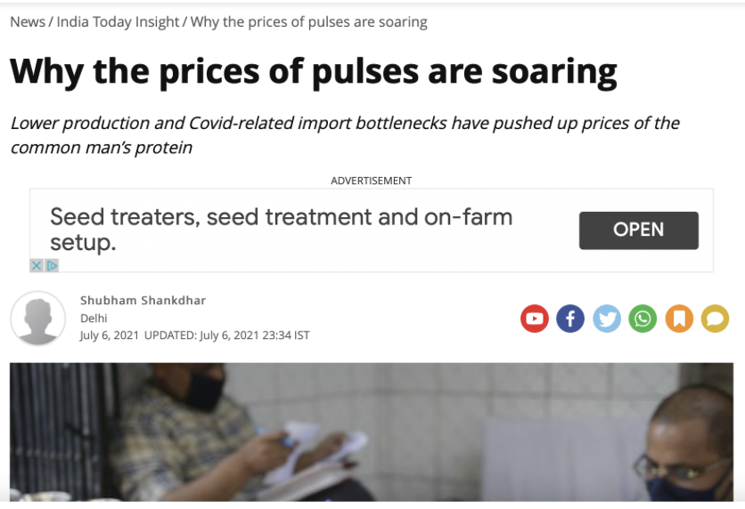

In April of 2021, *India* experienced sudden price increases of their top two most consumed pulses: chana (gram) and tur (pigeon peas) going from 100 Rp per kg to 130 Rp per kg causing the Indian government to remove quantitative restrictions on the import of pulses and signing contracts with various countries in order to import even more supply.

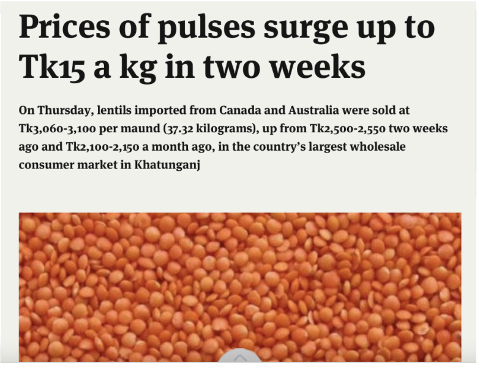

In Bangladesh’s largest market, prices of imported pulses from Australia and Canada surge Tk15 a kg in 2 weeks which many importers claimed was a result of the increase of booking price of all pulses in the international market

### FAO Food Price Indices

:::: {.columns style="gap: 1rem;"}
::: {.column width="50%"}
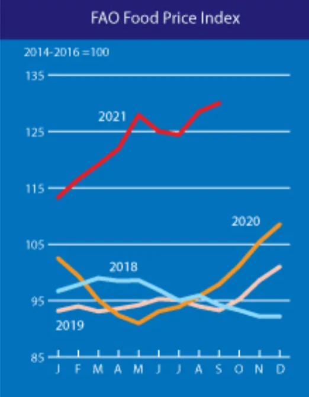{width="100%"}
:::
::: {.column width="50%"}
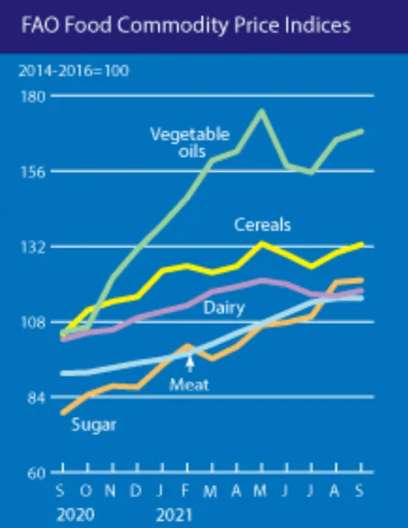{width="100%"}
:::
::::
Source: [FAO](https://www.fao.org/worldfoodsituation/foodpricesindex/en/)

Pulses are not the only food group experiencing price surges. Like the World Bank’s report suggested, all food commodity prices surged over the course of the past year and a half. The Food and Agriculture Organization (FAO) body of the UN has been tracking such price changes with their food price and food commodity price indices. Food prices experienced minor fluctuations throughout 2018 and 2019 but for the most part stayed stable. The end of 2020 through 2021 is where the biggest changes in the FPI occur. We can see from the graph on the right that while all tracked commodities experienced increases in pricing, none experienced a more dramatic increase than vegetable oils and sugar.

# Focus of Analysis

Pulses have been considered an environmentally-friendly and inexpensive alternative to commodities like meat, ideal in helping to combat food insecurity. The FFPI suggests that effects of the COVID-19 pandemic have caused dramatic price surges in all food groups, including pulses, that threaten our ability to feed the growing global population. But is it really just the impacts of the pandemic that threatens this ability?

In order to answer the ultimate question of: **“*How did observed pulse prices differ from pre-pandemic price dynamics during COVID-19?*”,** I wanted to focus on the price forecasts of this food group in countries most susceptible to food insecurity as determined by the WFP.

# Original Data

The data I chose to analyze to answer my question about ‘How did observed pulse prices differ from pre-pandemic price dynamics during COVID-19?’ is the World Food Programme’s collection of food price data from 78 different countries that they operate in. While this global prices dataset covers the prices of over 465 different products in 1759 markets from 1992-2018, the WFP did not collect the price data of all the same products from each country at the same time. Thus, there is some disconnect between countries. However, rather than focus on a single country and price data over a limited time, I hope that I can use this dataset to gain a greater understanding of the behavior of price over the most vulnerable parts of the world as a whole over a longer period of time. To get a better picture of the data, I have joined this dataset with datasets about the geographic location of the included markets and commodity category data that will help us focus in on our food group of interest. Both of these datasets have also been collated by the WFP.

::: {.callout-tip icon="false"}

## 🫘 Quick Facts
- WFP’s record of food prices in 78 countries that they service
- 901,179 records from 1992-2018
- Prices of over 465 unique products in 1759 different markets
:::

# Methodology

In order to examine the question of **“*How did observed pulse prices differ from pre-pandemic price dynamics during COVID-19?*”,** I will use:

- ***Google BigQuery*** to transform dataset to that of just Pulse price data and extract time series
- ***Google Data Studio*** to create visualizations of data
- ***R Studio*** (Ver 4.1.0) to perform time series forecasting with a gradient boosted tree model to visualize what could have happened to prices in 2019 - 2021 given data that ended in 2018.

# Focusing On The Pulses 

(Updated May 2025)

### Top 20 Most Sold Pulses in the Global South
<iframe 
  src="https://kanaries.net/analytics/chart/ens4ajttrh1c/share?theme=light&embed=yes" 
  width="100%" 
  height="600px" 
  frameborder="0"
  allowfullscreen>
</iframe>

::: {.callout-tip icon="false"}

## 🫘 In Brief
- **n = 176,752**
- **Year Range: 1994-2021**
- **56 countries**
- **1229 Different Markets**
:::

### Where are the Prices Coming From?
<iframe 
  src="https://kanaries.net/analytics/chart/ens6j25nery8/share?theme=light&embed=yes"
  width="100%" 
  height="600px" 
  frameborder="0"
  allowfullscreen>
</iframe>

As we can see, the pulses data is limited to countries in Africa, the Middle East, Southeast Asia, Central and South America.

# Results

The following includes a sample of the generated forecasts compared to the actual price performance of pulses in select markets. 

<a href="https://docs.google.com/document/d/1xo8jKavzRP8o68iKwkEMSi13YGSqap9Sn9hf7eN0gvI/edit?tab=t.0" target="_blank">
  <i class="bi bi-google"></i> View Full Results on Google Drive
</a>

## Masur Lentils (Retail) - Bangladesh

### *Forecast:*

In the visualization below, I include both the full data + forecast (left) and a zoom into the forecast (right)

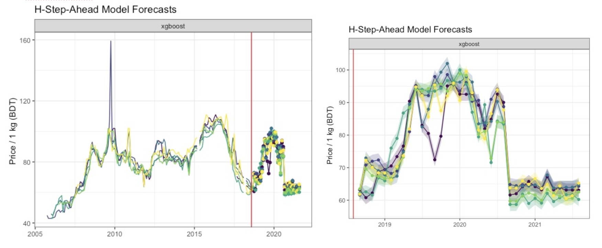

Masur Lentils price data was observed in Southeast Asian states like Bangladesh, India & Pakistan. The above forecast is based on price data from 6 markets in Bangladesh from October 2005 to August 2018. The September 2018 to August 2021 forecast was created using 3 validation windows of 24 months each, separated by 24 months.

### *Actual:*

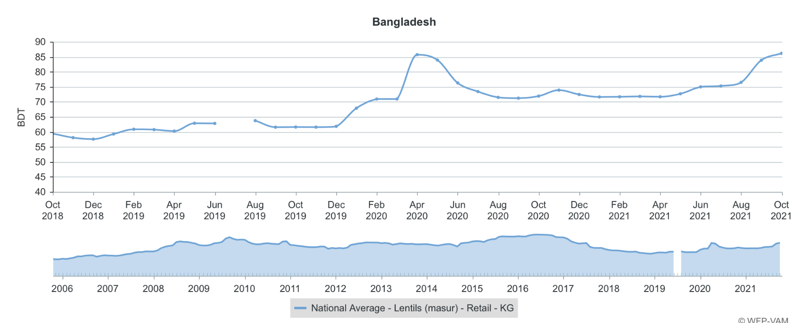

This is what actually happened to masur lentil prices in Bangladesh from October 2018 to October 2021. As I expected to see in most of the graphs of actual prices, the 36 month time series shows prices on an upward slope, increasing especially around mid 2020 and continuing into and through 2021. The average price of masur lentils hits a peak right around April-May 2020 at 85 & 84 BDT respectively. (A level we do not see the price hit again until October 2021) This peak happens to occur around the same time that the FAO’s FFPI begins to show rapid increase in price changes of food. This is different from what was forecasted, where the peak begins mid 2019 and does not recover till mid 2020 where it proceeds to stay pretty level at around 65 BDT for the rest of he forecast.

## Niebe Beans (Retail) - Burkina Faso

### *Forecast:*

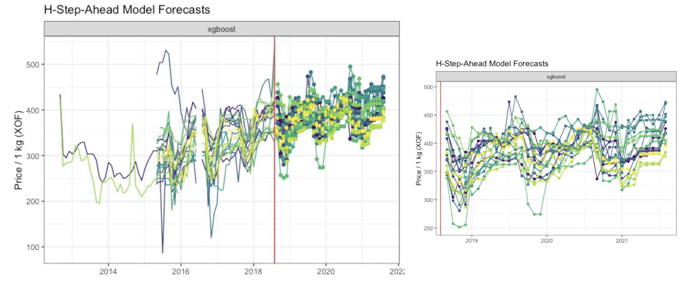

Niebe Beans retail price data was observed in North African States like Burkina Faso, Central African Republic & Mali. The forecast above is based on prices from 20 different markets in Burkina Faso from September 2012 to August 2018. The September 2018 to August 2021 forecast was created using 3 validation windows of 12 months separated by 12 months.

### *Actual*

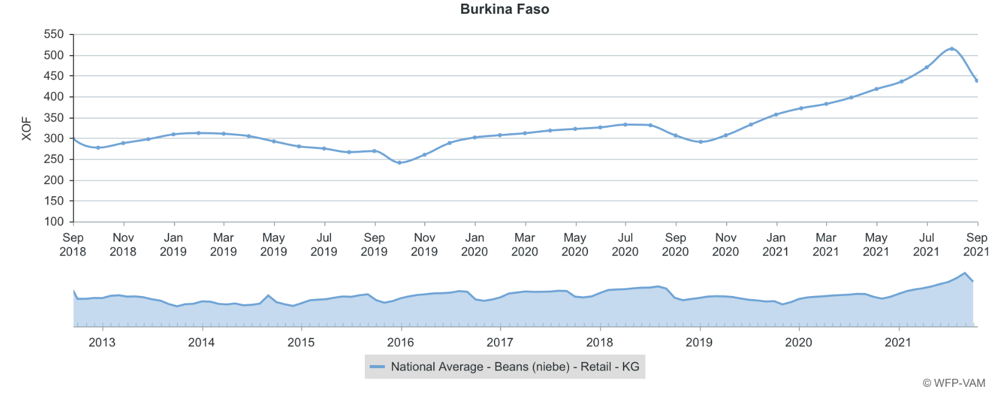

This is what actually happened to the prices of niebe beans from September 2018 to September 2021. As noted in the actual price of masur lentils, niebe bean prices are also steadily rising through this period. In both the forecast and the actual prices we see a seasonal dip that occurs in late 2018, 2019 and 2020. Actual prices range from about 250 to 510 XOF. Forecasted prices ranged from about 275 to 480 XOF.

## Beans (Retail) - Burundi

### *Forecast:*

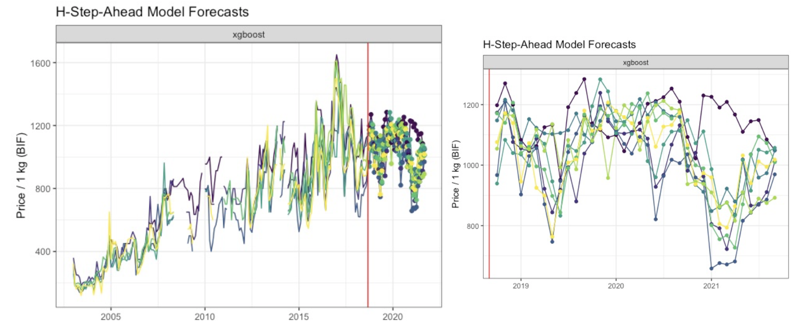

Beans retail price data was observed in Central & South African States like Burundi, Democratic Republic of the Congo, Malawi, Uganda & Zimbabwe and in Northern African states like Libya. The above forecast is based on prices from 8 different markets in Burundi from January 2003 to September 2018. The October 2018 to September 2021 forecast was constructed using 4 validation windows of 24 months separated by 30 months.

### *Actual:*

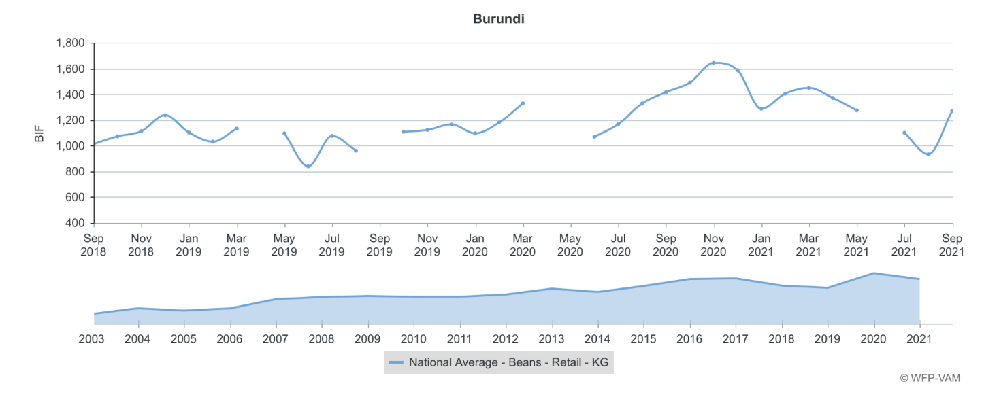

Again, we see an upwards trend in the actual retail prices of beans in Burundi. Both forecast and actual prices experiencing multiple dips the first being around mid 2019 and the last being in prices starting in early 2021 and begin to recover from it August/ September 2021. In fact, it seems like the forecast captured the same seasonality and cycles that occur in the actual price of beans just at a lower level. The forecast ranged between 1000 to 1300 BIF with the first dip hitting about 750 BIF and the last dip hitting an absolute low of about 670. The actual prices ranged from 1000 to 1650 BIF with the first dip hitting a low of about 850 BIF and the last dip hitting about 950 BIF.

## Imported Lentils (Wholesale) - Colombia

### *Forecast:*

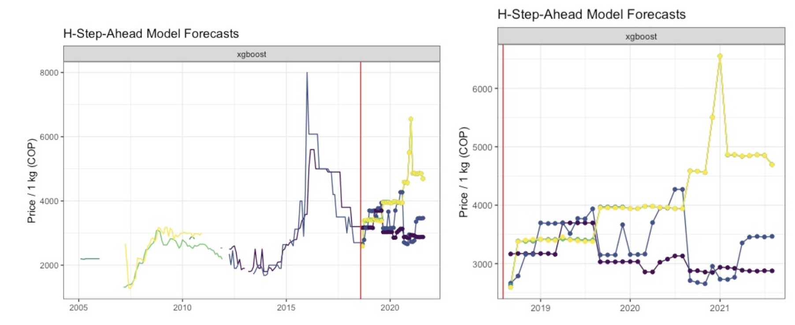

This is the price forecast of wholesale imported lentils given data from 5 markets in Colombia from February 2005 to August 2018. As many of the recent price surges in food products was occurring in the prices of imported food products, I thought this would be one of the most interesting forecasts to look at. The September 2018 to August 2021 forecast was constructed through the use of 5 validation windows, each 24 months long, separated by 6 months.

### *Actual*

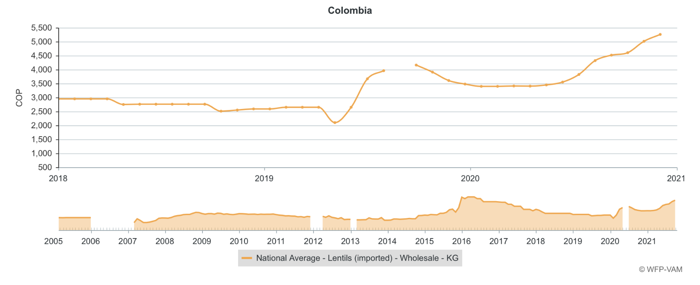

Actual prices experience a slight downwards trend, steadily decreasing from 3000 COP and hits a sudden dip mid-2019 at about 2000 COP. The rest of pictured period shows an upwards trend that peaks at 5250 COP. In the forecasted prices from the previous slide, forecasts differ greatly between markets. One (yellow) hits a peak of 6500 COP. The rest of the markets stay steady through the 36 month horizon ranging from about 2750 COP to 4250 COP.

## Black Beans (Retail)- Haiti

### *Forecast:*

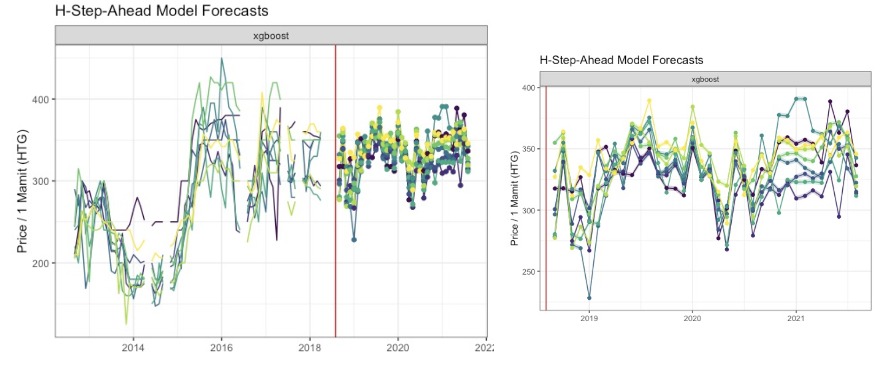

This forecast is based on prices from 9 markets in Haiti from September 2012 to August 2018. The September 2018 to August 2021 forecast was constructed through the use of 2 validation windows, each 30 months in length, separated by 6 months.

* [Mamit / Marmite: a bag]{style="color: #86B35D;"}

### *Actual*

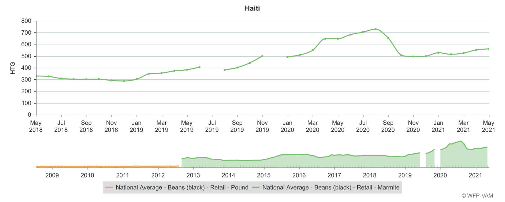

Actual Black bean prices in Haiti experienced an overall upwards trend starting around January - February 2019, hitting a peak of about 700 HTG in August 2020. The forecast hits a similar peak around late 2020 and early 2021 at 390 HTG. If one looks very closely in the period from May 2018 to January 2019, there is a slight downwards trend that is also captured in the forecast but is not illustrated to be as dramatic of a dip as in the forecast (about 250 HTG). Actual prices range from 300 to 700 HTG. Forecasted prices range from 250 HTG to 390 HTG.

## Lentils (Retail) - India

### *Forecast*

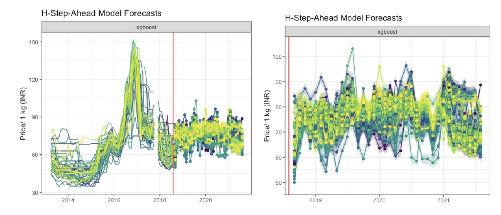

The Lentils retail prices I observed were from India, Yemen and countries surrounding the Mediterranean like Egypt, Syria & Turkey. The forecast displayed above is that of time series data from 56 markets in India from April 2013 to August 2018. The September 2018 to August 2021 was constructed through the use of 3 validation windows, each 12 months long, separated by 6 months.

### *Actual*

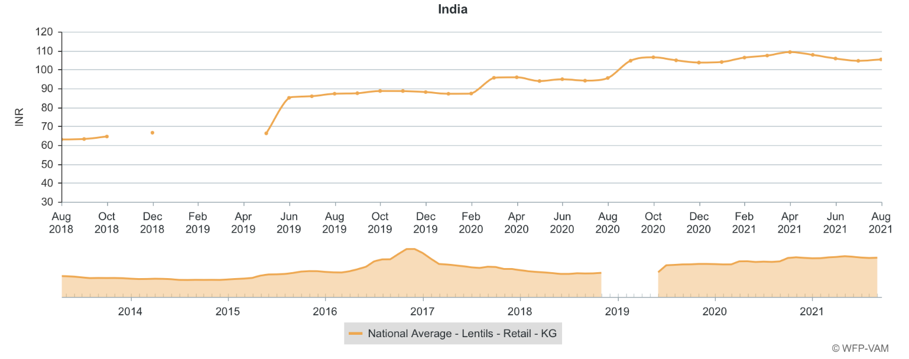

Actual prices of Indian lentils experienced an upwards trend in the pictured 36 months. There is a sudden change in level that occurs June 2019 that shifts the range from 60-70 INR to 85 - 110 INR. Forecasted prices also experienced a steady upwards trend that caused prices to range from 50-95 INR.

## Split, Dry Peas (Retail) - Lesotho

### *Forecast*

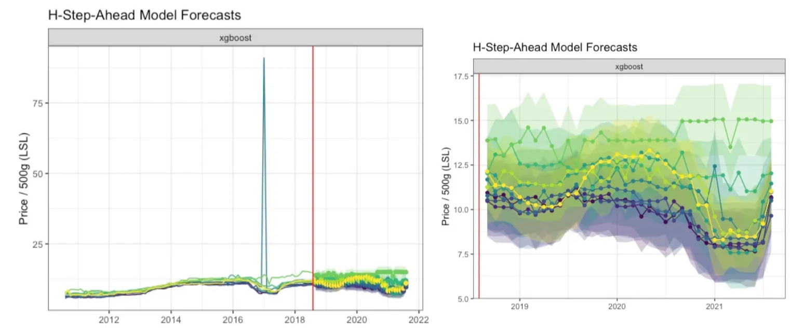

This forecast is based on the price data from 10 markets in Lesotho from August 2010 to August 2018. The September 2018 to August 2021 was constructed using 3 validation windows, each 24 months long, and separated by 9 months each.

### *Actual*

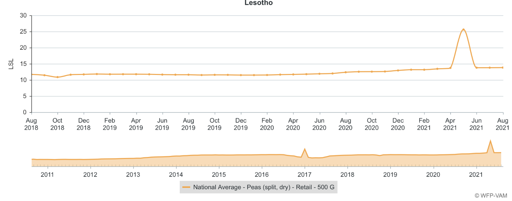

The behavior of actual split, dry pea prices in Lesotho is very similar to what was forecasted except for one major exception: the dip/surge that occurs early/mid-2021. In the actual prices, we can see a cycle of a sudden peak that is first seen in January 2017 that reoccurs in May 2021 (about 25 LSL). In the forecasted prices, there is a dip (about 8.5 LSL)that occurs at almost the same time as the peak discussed. Forecasted prices stayed level through the 36 month horizon, keeping mostly to a range of 10 -15 LSL (besides the dip). Actual prices also kept to the same trend and level except for the sudden peak discussed earlier.

## Cowpeas (Retail) - Mozambique

### *Forecast*

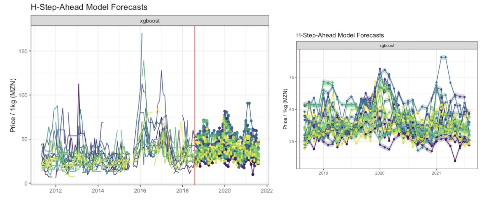

This forecast is based on the prices of 25 markets in Mozambique from May 2011 to August 2018. Constructed using 3 validation windows, each 18 months long, separated by 9 months each.

### *Actual*

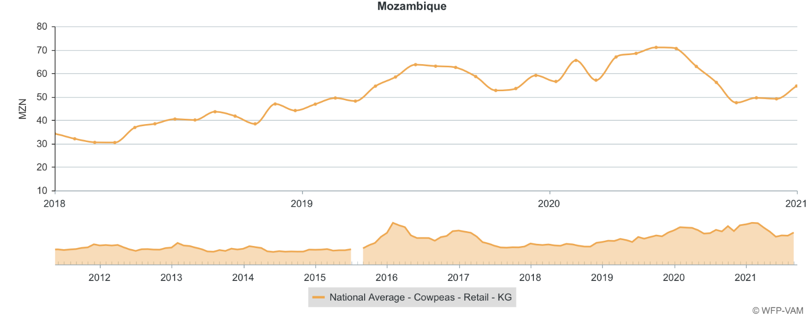

The actual prices of cowpeas in Mozambique mostly trends upwards after a slight decline from September 2018 to November 2018. This changes sometime right before the start of 2021 where there is a slightly deeper dip than usual. Interestingly, a very similar thing happens around the same time in the forecast as well. The forecast also shows seasonal highs around the early parts of each year that coincide with the similar annual peaks that are seen in the actual prices above.

## Chickpeas (Retail) - Tajikistan

### *Forecast:*

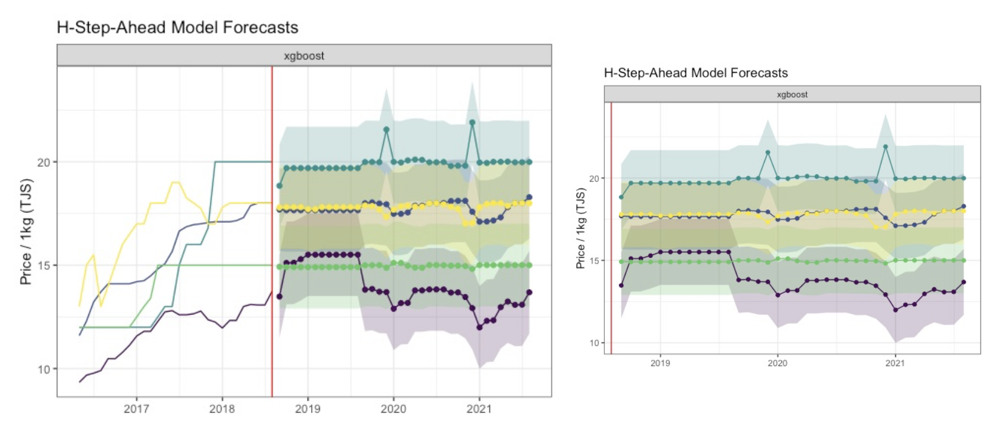

Chickpea retail price data was observed in Libya, the State of Palestine, the Syrian Arab Republic, Tajikistan and Turkey. This forecast is based on prices from 5 markets in Tajikistan from May 2016 to August 2018. Constructed using 3 validation windows, each 8 months long, separated by 2 months.

### *Actual*

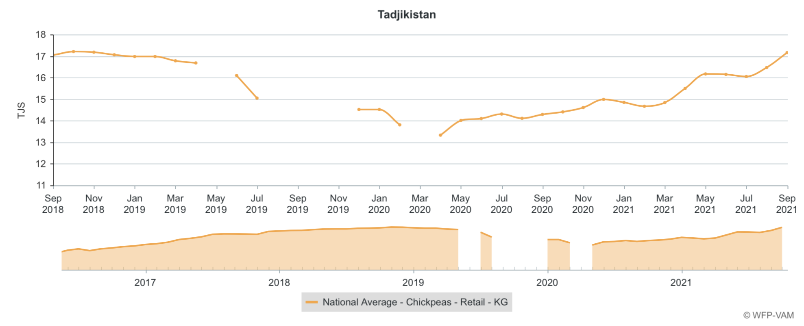

As one can see, the actual prices of chickpeas in Tajikistan behaved very differently from what the forecast predicted. Actual prices experienced a downwards trend to about April 2020, hitting an absolute minimum of about 13.5 TJS. From May 2020 to the September 2021, prices experience an upwards trend, hitting a maximum of 17 TJS. The forecast seems to have depended on seasonality for prediction as most behavior that causes the different market time series to deviate from the same prices occurs at the beginning of each year. The one thing that the forecast and actual prices seem to agree on is how prices do not change too significantly from October 2018 to about February 2019.

## White Beans (Retail) - Turkey

### *Forecast*

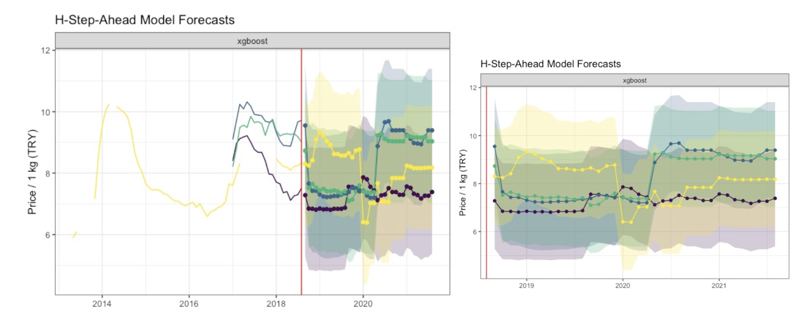

I observed white beans retail price data from the Republic of the Congo, Djibouti, Iraq, Syria, Turkey and Yemen. The above forecast is based on prices from 4 markets in Turkey from May 2013 to August 2018. Constructed using 3 validation windows, each 18 months long, separated by 4 months.

### *Actual*

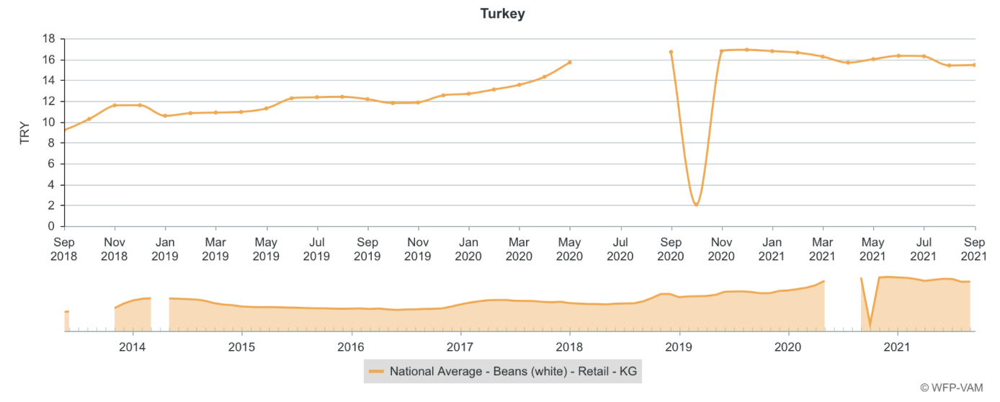

This is what actually happened to white bean prices in Turkey from September 2018 to September 2021. Prices trend upward through the entire period growing from around 9 TRY, peaking at around 17 TRY in September & November 2021. It almost looks like prices could have reached a slightly higher peak around July 2020 (the absolute peak in the forecast occurs right before the major dip) but the WFP does not have the data to confirm whether this happened. Like actual prices, the forecast experiences a major dip (about 7 TRY). The difference being actual prices dipped in October 2020 (to 2 TRY) while forecasted prices dramatically dipped around January and February 2020. Forecasted prices range between 7-9 TRY.

## Dry Beans (Retail) - Zambia

### *Forecast:*

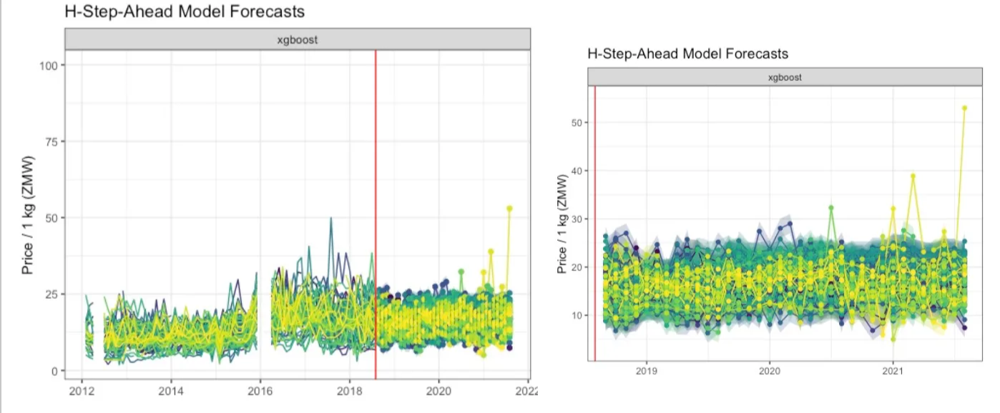

The dry beans retail price data I observed was from African states like Gambia, Kenya & Zambia. The above forecast is based on prices from 69 markets in Zambia from January 2012 to August 2018. Constructed using 3 validation windows, each 19 months long, separated by 11 months each.

### *Actual*

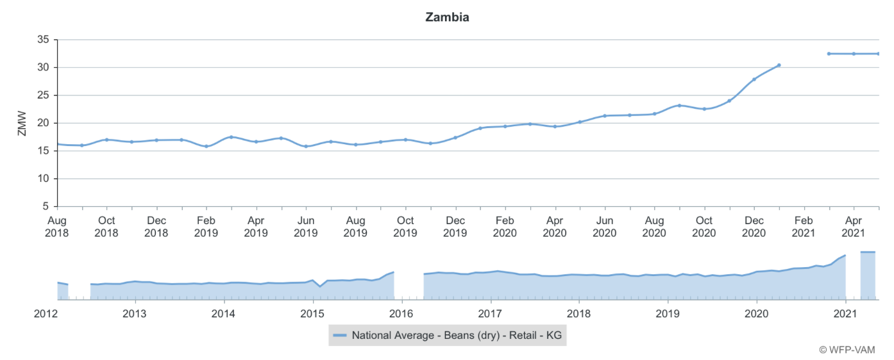

The actual prices of dry beans in Zambia stay pretty level (around 15-20 ZMW) but start to trend upward around early 2020, hitting a peak at 32 ZMW that plateaus through May 2021. The forecast differs slightly where most markets stayed level through the entire 36 month horizon, ranging between 5-25 ZMW. However, there is one market in our forecast that hits a peak of about 55 ZMW around the same time the actual prices hit their peak in mid-2021.

# Conclusion

## Key Takeaways

- Forecasts predicted overall lower pricing for Pulses, suggesting the Pandemic may have triggered a series of unobserved events resulting in actual prices rising more than expected
- Cyclical behaviors occurring in both forecasts and actual pricing suggest that there are deeper long term issues that need to be addressed in order to maintain viability of pulses as a food source.

While as we predicted, prices of pulses could have been consistently lower if the pandemic had not occurred, the forecasts picked up cyclical behaviors that (for the most part) also occurred in the plots of actual prices.  A further study could be done in what was already occurring in pulse production that is causing the cyclical behavior as that could give a better indication of long term issues in pulse production that threaten its potential.

# Work Cited

## Data (Available in GitHub Repo):

WFP - World Food Programme. (2021). Global Food Prices Database [CSV] Retrieved from [https://data.humdata.org/dataset/wfp-food-prices](https://data.humdata.org/dataset/wfp-food-prices)

WFP- World Food Programme. (2021) Global WFP commodities [CSV] Retrieved from [https://data.humdata.org/dataset/global-wfp-food-prices](https://data.humdata.org/dataset/global-wfp-food-prices)

WFP - World Food Programme. (2021). Global WFP markets [CSV] Retrieved from [https://data.humdata.org/dataset/global-wfp-food-prices](https://data.humdata.org/dataset/global-wfp-food-prices)

## Sources:

“About the International Year of Pulses.” *About | 2016 International Year of Pulses*, Food and Agriculture Organization of the UN, [https://www.fao.org/pulses-2016/about/en/](https://www.fao.org/pulses-2016/about/en/)

“Climate and Food Security Analyses: World Food Programme.” *UN World Food Programme*, [https://www.wfp.org/climate-and-food-security-analyses](https://www.wfp.org/climate-and-food-security-analyses)

“Economic: Prices - Dataviz: WFP - VAM.” *WFP | Vam Food Security Analysis*, World Food Programme, [https://dataviz.vam.wfp.org/economic_explorer/prices](https://dataviz.vam.wfp.org/economic_explorer/prices) 

“FAO Food Price Index.” *FAO Food Price Index | World Food Situation | Food and Agriculture Organization of the United Nations*, [https://www.fao.org/worldfoodsituation/foodpricesindex/en/](https://www.fao.org/worldfoodsituation/foodpricesindex/en/)

Faruque, Omar. “Prices of Pulses Surge up to TK15 a Kg in Two Weeks.” *The Business Standard*, The Business Standard, 10 Sept. 2021, [https://www.tbsnews.net/markets/prices-pulses-surge-tk15-kg-two-weeks-300775](https://www.tbsnews.net/markets/prices-pulses-surge-tk15-kg-two-weeks-300775)

Mishra, Vivek, et al. “Pulse Puzzle 2021.” *Down To Earth*, DownToEarth, 2 Sept. 2021, [https://www.downtoearth.org.in/news/food/pulse-puzzle-2021-78749](https://www.downtoearth.org.in/news/food/pulse-puzzle-2021-78749) 

Pulses and Climate Change - Fao.org.” *Food and Agriculture Organization of the United Nations*, Food and Agriculture Organization of the United Nations, Feb. 2021, [http://www.fao.org/3/i5426e/i5426e.pdf](http://www.fao.org/3/i5426e/i5426e.pdf)

“Pulses for Food Security and Nutrition - Home | Food and ...” *Global Forum on Food Security and Nutrition*, Food and Agriculture Organization of the UN, Dec. 2016, [http://www.fao.org/3/i6690e/i6690e.pdf](http://www.fao.org/3/i6690e/i6690e.pdf)

Redell, Nickalus. “Direct Forecasting with Multiple Time Series.” *Cran.r-Project*, 5 May 2020, [https://cran.r-project.org/web/packages/forecastML/vignettes/grouped_forecast.html](https://cran.r-project.org/web/packages/forecastML/vignettes/grouped_forecast.html)

Ritchie, Hannah. “You Want to Reduce the Carbon Footprint of Your Food? Focus on What You Eat, Not Whether Your Food Is Local.” *Our World in Data*, Global Change Data Lab, 24 Jan. 2020, [https://ourworldindata.org/food-choice-vs-eating-local](https://ourworldindata.org/food-choice-vs-eating-local)

Shankdhar, Shubham. “Why the Prices of Pulses Are Soaring.” *India Today*, Living Media India Limited, 6 July 2021, [https://www.indiatoday.in/india-today-insight/story/why-the-prices-of-pulses-are-soaring-1824583-2021-07-06](https://www.indiatoday.in/india-today-insight/story/why-the-prices-of-pulses-are-soaring-1824583-2021-07-06)

World Bank Group. “Food Security and Covid-19.” *World Bank*, World Bank Group, 21 Oct. 2021, [https://www.worldbank.org/en/topic/agriculture/brief/food-security-and-covid-19](https://www.worldbank.org/en/topic/agriculture/brief/food-security-and-covid-19)

