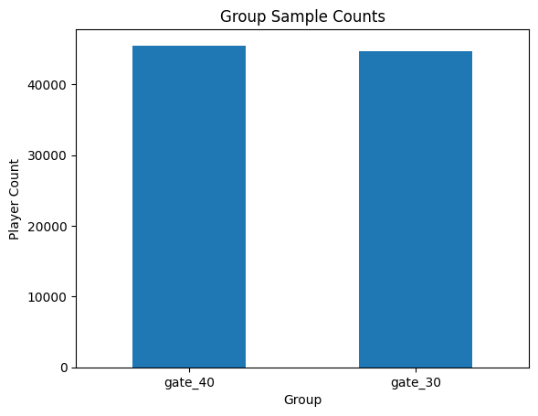
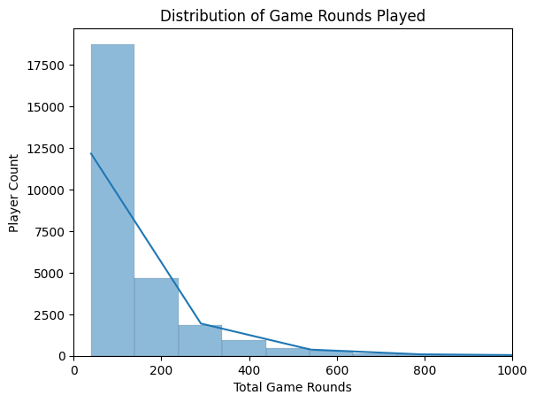

{width="100%"}

# Summary: 
Designed and analyzed an A/B test (n=90,000+) to evaluate the impact of progression gating on player retention in a mobile game. Found that the majority of users churned before reaching either gate level, revealing that late-stage gating has limited leverage on overall retention. Among high-engagement players who reached the gates, minimal 7 day retention lift was observed between gate 30 versus 40. Recommended shifting experimentation to earlier-game friction points (levels 5 & 10) to meaningfully impact retention and lifetime value.

::: {.callout-tip icon="false"}
## 👾 Key Takeaways
- Because over 60% of players churned before reaching level 40, the effective sample size dropped to ~27K.
- This compromised the statistical sensitivity of the tests for Early Return Behavior and Gameplay Depth.
- Mid-term Retention, though adequately powered and showing that there was a statistically significant difference between the gate 30 and gate 40, only shows a minimal difference leading to questions of whether it is meaningful enough.
:::

## Methods:

- Retrospective Sensitivity Analysis/ Power Analysis
- A/B Testing of Binary & Continuous Variables:
    - Hypothesis Testing
        - $X^2$ test
        - Mann-Whitney U Test

## Tools/ Packages Used:

- Python 3.13.3
    - `pandas` `numpy`  `matplotlib.pyplot` `statsmodel.stats` `pingouin`

<a href="https://github.com/s-Yk88/Game-Retention" target="_blank">
  <i class="bi bi-github"></i> View Code on GitHub
</a>

# Background
One of the main goals of any game is to retain players. A common method of influencing player engagement and retention is the progression system. Progression systems, in general, help give players a sense of progression and completion of goals, which makes games more enjoyable.   Within many games, a more specific progression feature known as a progression gate temporarily halts progress, encouraging players to take an action such as waiting, inviting friends, or making an in-app purchase. This, in turn, boosts the average lifetime value per player, a goal of any company building games. Here, we will see how changing when the progression gate occurs may impact retention metrics.

# Data
This dataset includes A/B test results of Cookie Cats, a mobile puzzle game from [Tactile Entertainment](https://tactilegames.com/games/cookie-cats/) , to examine what happens when the first gate in the game was moved from level 30 to level 40. 

| Variable | Description |
| --- | --- |
| **`userid`** | unique identifiers for each player |
| **`version`** | Whether the player was put in the control group (gate_30 - a gate at level 30) or the group with the moved gate (gate_40 - a gate at level 40). |
| **`sum_gamerounds`** |  the total number of game rounds played by each user during the testing period. |
| **`retention_1`** | Did the player return to the game after 1 day? (Categorical [0,1]) |
| **`retention_7`** | Did the player return to the game after 7 days? (Categorical [0,1]) |

# Experiment Design

::: {.callout-tip icon="false"}
## 👾 In Brief
- n= 90,189 players
- Target Variables:  `sum_gamerounds` `retention_1` `retention_7`
- Control Group: `gate_30` response group of `version` variable
- Test Group: `gate_40` response group of `version` variable
- Players were randomly assigned at Install
:::

## Primary Question
> [*Can shifting a progression gate from level 30 to level 40 meaningfully improve player retention and engagement?*]{style="color: #86B35D;"}

To evaluate the impact of shifting the progression gate, I analyzed:

- 1 Day Retention
- 7 Day Retention
- Total Game Rounds Played

Each metric captures a different stage of engagement: early return behavior, mid-term retention, and depth of game play.

## Balance Check
:::: {.columns style="gap: 1rem;"}
::: {.column width="50%"}

:::
::: {.column width="50%"}
Before running any sort of experiment comparing the effects of different progression gates on retention, we need to check that there is balanced randomized assignment. Ultimately, we find that both groups have been assigned almost the same number of players each. The `gate_30` group has [**44700**]{style="color: #86B35D;"} players and the `gate_40`  group has [**45489**]{style="color: #86B35D;"} players.
:::
::::

# Critical Observation: Early Player Churn

|  | Gate 30 | Gate 40 |
| --- | --- | --- |
| Count | 44700 | 45489 |
| Mean | 52.456 | 51.299 |
| Std | 256.716 | 103.294 |
| Min | 0 | 0 |
| 25% | 5 | 5 |
| Median | 17 | 16 |
| 75% | 50 | 52 |
| Max | 49854 | 2640 |

While the dataset we are using has been been cleaned (of NAs) prior to our use, we can check the summary statistics of the numeric variables to make sure that the data we are using can actually answer our question. While the mean number of rounds played by each version group are about [**52**]{style="color: #86B35D;"} and [**51**]{style="color: #86B35D;"} respectively, the medians tell a very different story. 

The median of the players in the `gate_30` version only reached up to round [**17**]{style="color: #86B35D;"} and median of the `gate_40` version players only reached up to round [**16**]{style="color: #86B35D;"}. As the mean can be easily influenced by extreme outliers (shown by the max game rounds played), the average player seems to have never gotten close to the level 30 or 40.

> [*So, what happens when we limit the sample groups to that of players that actually reach both tested progression gate levels (x≥ 40)?*]{style="color: #86B35D;"} 

Both sample groups shrink to that of about 30% of the original version sample groups, for a total sample size of [**27,393**] players. As we do not know the actual number of players that play Cookie Cats, this sample could be too small to be able to extrapolate our results to the total player population. On the other hand, the sample sizes are still relatively large ([**>10,000**]{style="color: #86B35D;"}), decreasing the likelihood of type I & II error.

For the sake of this analysis, we will use this limited sample to test our hypotheses.

|  | Gate 30 | Gate 40 |
| --- | --- | --- |
| Count | 13566 | 13827 |
| Mean | 145.713 | 142.668 |
| Std | 452.119 | 151.198 |
| Min | 40 | 40 |
| 25% | 57 | 58 |
| Median | 90 | 92 |
| 75% | 167 | 165 |
| Max | 49854 | 2640 |

# Restrospective Sensitivity Analysis

After having observed that [**60%**]{style="color: #86B35D;"} of our sample churns far earlier than level 40, a good question to consider is:

> [*Given the effective sample size (~27,000), what magnitude of effect can we expect to detect?*]{style="color: #86B35D;"}

This is because the larger a sample size is, the larger the statistical power and the likelihood of detecting a truly significant effect as the larger size makes it easier to detect effect. The early churn of players may invalidate some of our results.

For the categorical variables, we will use Cohen’s h to attain the effect size measure and determine the required sample size for a chi-square test to be adequately powered. For the continuous variable, due to the skew in the data, we will use the rank biserial r as the measurable effect and determine the required sample size for an adequately powered Mann-Whitney U Test.

## 1 Day Retention

Both gate versions happened to retain a little under half of their player samples after one day. The `gate_30` group retains roughly [**83.8%**]{style="color: #86B35D;"} of its players and the `gate_40` group retains about [**83.0%**]{style="color: #86B35D;"} of its players after 1 day.  Below, we tracked the effect size given a variety of percentage point differences, the required sample size to achieve 80% power, and the actual power when n is 13,566.

| Percentage Point Difference | Effect (Cohen’s h) | Required *n* per group (to achieve 80%) | Achieved Power when n= 13,566 |
| --- | --- | --- | --- |
| 0.5 | 0.013 | ~89626 | 0.19 |
| [0.8 (actual)]{style="color: #86B35D;"} | [0.022]{style="color: #86B35D;"}| [~33953]{style="color: #86B35D;"} | [0.43]{style="color: #86B35D;"} |
| 1 | 0.027 | ~21623 | 0.61 |
| 2 | 0.055 | ~5270 | 0.994 |
| 3 | 0.083 | ~2280 | 1 |

For the actual difference between the retention rates, the achieved power is [**43%**]{style="color: #86B35D;"}, meaning that the reduced samples will not detect an effect of size 0.8. At n=13,566, we need a [**~1.5%**]{style="color: #86B35D;"} point difference to achieve 80% power.

## 7 Day Retention

After 7 days, there is drastic drop off in players in both versions. Like earlier, both versions seem to retain a similar amount of players. The `gate_40`  group retains about [**50.3%**]{style="color: #86B35D;"} after 7 days, while the `gate_30` group  retains about [**48.5%**]{style="color: #86B35D;"} of its players. 

| Percentage Point Difference | Effect (Cohen’s h) | Required *n* per group (to achieve 80%) | Achieved Power when n= 13,566 |
| --- | --- | --- | --- |
| 0.5 | 0.010 | ~156,784 | 0.131 |
| 1 | 0.020 | ~39,227 | 0.380 |
| [1.8 (actual)]{style="color: #86B35D;"} | [0.036]{style="color: #86B35D;"} | [~12,109]{style="color: #86B35D;"} | [0.846]{style="color: #86B35D;"} |
| 3 | 0.060 | ~4359 | 0.999 |
| 5 | 0.100 | ~1568 | 1 |

For the actual percentage point difference between the gating groups, we find that the achieved power is [**84.6%**]{style="color: #86B35D;"}, meaning that the reduced samples will detect an effect of this size. 

## Total Games Played
:::: {.columns style="gap: 1rem;"}
::: {.column width="50%"}
To the right,  we are checking the distribution of game rounds played by the players during the course of the first 7 days. We expect to see this skew right, indicating that most players only play a few rounds and only a few players play a large number of rounds. As we can see, the distribution shows just as we expected with a majority of players playing below 300 games and only a  few making it to the 1000 round mark.
:::
::: {.column width="50%"}

:::
::::

| Effect (Rank Biserial R-RBC) | Cohen’s d | Required *n* per group (to achieve 80%) | Achieved Power when n= 13,566 |
| --- | --- | --- | --- |
| 0.005 | 0.010 | ~156,974 | 0.131 |
| [0.013 (actual)]{style="color: #86B35D;"} | [0.026]{style="color: #86B35D;"} | [~22610]{style="color: #86B35D;"} | [0.587]{style="color: #86B35D;"} |
| 0.02 | 0.040 | ~9808 | 0.911 |
| 0.03 | 0.060 | ~4358 | 0.999 |
| 0.05 | 0.100 | ~1567 | 1 |

The RBC of [**0.013**]{style="color: #86B35D;"} indicates that `gate_30` players only marginally outrank `gate_40` players in total games played. More specifically, `gate_30` players outrank `gate_40` in approximately [**50.7%**]{style="color: #86B35D;"} of random pairings versus [**49.35%**]{style="color: #86B35D;"}. For this small effect, we find that the achieved power is [**58.7%**]{style="color: #86B35D;"}, meaning that the reduced samples will not detect an effect of this size.

This analysis reveals that early churn didn’t just reduce experiment relevance, it compromised the statistical sensitivity of two out of the three metrics. Only the 7-Day Retention is adequately powered enough to detect the observed effect.

As the lack of power in early return behavior (`1-Day Retention`) and gameplay depth (`Total Game Rounds Played`) measures leads us to a pretty high risk of type 2 error, I would want to rerun the experiment to have a sufficient number of respondents that reach the required levels to be affected by the progression gates. But for the purpose of practice, we will continue with these samples.

::: {.callout-tip title="Power Analysis Result"}
*Because over 60% of players churned before reaching level 40, the effective sample size dropped to ~27K.*

- Early Return Behavior and Gameplay Depth are underpowered in detecting the current size of effect
- Mid-Term Retention is adequately powered to detect the observed size of effect.
:::

# Analysis

## Chi Square ($X^2$) Test of Independence:

To test the 1 day and 7 day retention metrics, I will use $X^2$ tests as we are comparing 2 unpaired sample groups. $X^2$ tests are generally used to examine whether 2 categorical variables are independent in influencing the test statistic.

|  | P-Values |
| --- | --- |
| 1 Day Retention | 0.10231 |
| 7 Day Retention | 0.00333 |

Using $\alpha$=0.05 as our significance level, we fail to reject the null hypothesis for the `retention_1` variable and conclude there is no statistically significant difference in the 1 day retention metric between the different gate groups. However, as evidenced by retrospective sensitivity analysis, this test was inadequately powered ([**43%**]{style="color: #86B35D;"}), thus this result should be considered with caution.

In comparison, we can reject the hypothesis for the `retention_7` variable, concluding there is a statistically significant difference in the 7 day retention metric between the different level gate groups. The earlier sensitivity analysis concluded that this test is adequately powered ([**84.6%**]{style="color: #86B35D;"}) to detect the observed effect (h=0.036) between the two groups, further validating the result.

While the result of the 7 Day Retention test is promising, we do have to consider whether instituting a change for such a small effect is worth it. With a rough estimate of 2 million installs, this difference represents about [**36,000**]{style="color: #86B35D;"} additional players being retained after a week.

## Mann-Whitney U Test

To test our continuous `sum_gamerounds` variable, I will use a Mann Whitney U Test. While we could have tried to use a t-test, our `sum_gamerounds` variable violates one very important assumption of the t-test: the data is not normally distributed (as seen in the retrospective power analysis). When we run the test, we find that:

| U-Statistic | 92552991.50 |
| --- | --- |
| p-value | 0.05900 |

As our $\alpha$=0.05 and the p-value is [**0.06**]{style="color: #86B35D;"}, convention would suggest that we fail to reject the hypothesis and conclude there is no statistically significant difference between the median number of rounds played in each group. 

However, the retrospective sensitivity analysis from earlier revealed that this test is only [**59%**]{style="color: #86B35D;"} powered to detect the observed effect ([**RBC=0.013**]{style="color: #86B35D;"}), falling short of the conventional 80% power threshold. The required sample of [**~22,600**]{style="color: #86B35D;"} per group exceeds what was available from the effective sample. As a result of this, the borderline p-value of [**0.06**]{style="color: #86B35D;"} should be interpreted carefully.

::: {.callout-tip title="Experiment Results"}

`retention_1` : Fail to reject the null hypothesis and must conclude there is no statistically significant difference in the 1 day retention metric between the 2 versions. Early player churn compromises the test’s statistical sensitivity, so this result should be considered with caution.

`retention_7` : Can reject null hypothesis and conclude there is a statistically significant difference in the 7 day retention metric between the 2 different versions. While the test is adequately powered, the small observed difference between groups may not be enough to warrant actual changes.

`sum_gamerounds`: Fail to reject the null hypothesis and conclude there is no statistically significant difference between the median number of rounds played in each group. However, as early player churn compromises the test’s statistical power, this result will be considered with caution.

:::

# Conclusion

From the experiments, we found that a statistically significant difference was observed in 7-day retention. Despite that, the effect size is modest and not supported by differences in early retention or total gameplay volume, leading to questions of whether the tested change would actually be meaningful. Monetization data may be able to provide further context for whether the results are meaningful enough.

Instead, the main finding of early player churn (before either progression gate), indicates that late-stage gating is unlikely to influence overall retention metrics at scale. This suggests retention improvements will likely come from optimizing early-game friction and onboarding mechanics rather than adjusting mid-game progression thresholds.

## Recommendations

In light of these results, my main concern is what is happening during the earlier rounds of the game that is causing a majority of players to churn. Thus, this experiment should be ran again with progression gates at levels 5 and 10. Assuming that retention effects will be larger earlier in the game, the same sample sizes will give higher power.

# Sources

[https://medium.com/womenintechnology/log-transformation-to-mitigate-the-effect-of-outliers-413cdd275495](https://medium.com/womenintechnology/log-transformation-to-mitigate-the-effect-of-outliers-413cdd275495)

[https://medium.com/data-science/step-by-step-for-planning-an-a-b-test-ef3c93143c0b](https://medium.com/data-science/step-by-step-for-planning-an-a-b-test-ef3c93143c0b)

[https://www.statsols.com/articles/types-of-statistical-tests](https://www.statsols.com/articles/types-of-statistical-tests ) 

[https://en.wikipedia.org/wiki/Chi-squared_test](https://en.wikipedia.org/wiki/Chi-squared_test)

[https://www.reddit.com/r/gamedesign/comments/1eh2n7f/introductory_guide_to_game_progression_and/](https://www.reddit.com/r/gamedesign/comments/1eh2n7f/introductory_guide_to_game_progression_and/)

[https://play.google.com/store/apps/details?id=dk.tactile.cookiecats&hl=en_US](https://play.google.com/store/apps/details?id=dk.tactile.cookiecats&hl=en_US)