# Summary

This analysis explores how user-curated playlists surface K-pop tracks and whether there are observable differences in engagement signals that explain exposure. Using Spotify API data for the top tracks of 27 K-pop groups, I engineered artist and track level features including popularity, label affiliation, group composition, and audio attributes. Then, combined exploratory analysis, interpretable modeling, and robustness checks to identify which signals consistently differentiate exposed tracks. The results illustrate how observable engagement and structural signals may be used to better understand content exposure in algorithmically entwined discovery systems.

::: {.callout-tip icon="false"}

## 🎤 Key Takeaways
- Playlist inclusion is relatively rare (only 13% of the sample), but is concentrated among tracks with high popularity scores.
- Track popularity is a strong predictor of inclusion, but does not fully explain engagement differences.
- Even after controlling for artist and track features, playlisted tracks show higher engagement.
- Big 4 affiliation and gender show consistent associations even after adjustment, suggesting there is also a structural dynamic involved.
- Playlist inclusion and popularity reinforce one another and are likely influenced by unobserved promotional, social, and algorithmic mechanisms.
- Findings provide a framework for operationalizing content discovery signals to inform platform strategy, recommendation optimization, and audience development decisions.
:::

## Methods:

- Data Visualization
- Regression Analysis
- Feature Engineering
- Confounder Adjusted Analysis

## Models:

- Logistic Regression
- Elastic Net
- Covariate-Adjusted Regression

## Tools/ Packages Used:

- R
    - `corrplot` `tidyverse` `ggplot2`  `car` `caret` `glmnet` `pROC` `vip` `recipes` `dotwhisker` `ggridges`
- Python 3.13.3
    - `spotipy` `pandas` `numpy`  `networkx`

<a href="https://github.com/s-Yk88/kpop_engage" target="_blank">
  <i class="bi bi-github"></i> View Code on GitHub
</a>

# Background:

Korean pop music (K-Pop) exploded in popularity across the globe over the past decade, driven primarily by accessibility via globalization. Specifically, accessibility in terms of audio and visual content across social media and entertainment streaming. Korean dramas have proliferated via localization efforts by *Netflix*, while *Spotify’s* global growth strategy has required expansion of their music catalog. 

The same can be said of the Korean music industry. The management companies responsible for pumping out new groups and idols like *HYBE* (the home of BTS) have expanded their reach with major international partnerships but have also diversified their portfolio domestically to sustain demand. This shift in structure raises questions about how music content gains visibility in global markets as corporate strategy and partnerships evolve.

Historically, there has been a huge difference between what artists and tracks are popular domestically versus abroad. This difference suggests that global discovery is not only influenced by audience preferences but also by engagement signals, structural advantages, and platform visibility.

### In this analysis, I focus on:

> [*What types of songs appear in user-curated playlists and are measurable signals useful in determining playlist inclusion?*]{style="color: #86B35D;"}

### Why Do Discovery Signals Matter?

As algorithms increasingly decide how audiences encounter content, discovery mechanisms dictate not only what becomes popular but what remains unseen. Understanding which signals correlate with exposure helps to show how content like music circulates and whether that visibility is the result of listener demand, structural advantage, or platform intervention.

# Data (Available on Github)

Pulled from Spotify $^2$ via its API in August 2025— the data includes track metadata,  playlist membership $^1,$ artist metadata, and other factors that may help to explain exposure.

I chose about 27 different k-pop groups of various debuts, management companies, discography and popularities. These include: [[BTS](https://en.wikipedia.org/wiki/BTS), [BLACKPINK](https://en.wikipedia.org/wiki/Blackpink), [TWICE](https://en.wikipedia.org/wiki/Twice), [SEVENTEEN](https://en.wikipedia.org/wiki/Seventeen_(South_Korean_band)), [Stray Kids](https://en.wikipedia.org/wiki/Stray_Kids), [NCT 127](https://en.wikipedia.org/wiki/NCT_127), [NCT DREAM](https://en.wikipedia.org/wiki/NCT_Dream), [ENHYPEN](https://en.wikipedia.org/wiki/Enhypen), [TOMORROW X TOGETHER](https://en.wikipedia.org/wiki/Tomorrow_X_Together), [NewJeans](https://en.wikipedia.org/wiki/NewJeans), [IVE](https://en.wikipedia.org/wiki/Ive_(group)), [ITZY](https://en.wikipedia.org/wiki/Itzy), [I-dle](https://en.wikipedia.org/wiki/I-dle), [ATEEZ](https://en.wikipedia.org/wiki/Ateez), [LE SSERAFIM](https://en.wikipedia.org/wiki/Le_Sserafim), [Red Velvet](https://en.wikipedia.org/wiki/Red_Velvet_(group)), [EXO](https://en.wikipedia.org/wiki/Exo), [SHINee](https://en.wikipedia.org/wiki/Shinee), [STAYC](https://en.wikipedia.org/wiki/STAYC), [BABYMONSTER](https://en.wikipedia.org/wiki/Babymonster), [BOYNEXTDOOR](https://en.wikipedia.org/wiki/BoyNextDoor), [NMIXX](https://en.wikipedia.org/wiki/Nmixx), [Xikers](https://en.wikipedia.org/wiki/Xikers), [KEP1ER](https://en.wikipedia.org/wiki/Kep1er), [CRAVITY](https://en.wikipedia.org/wiki/Cravity), [Billlie](https://en.wikipedia.org/wiki/Billlie), [H1-KEY](https://en.wikipedia.org/wiki/H1-Key),]{style="color: #86B35D;"} and [[RIIZE](https://en.wikipedia.org/wiki/Riize)]{style="color: #86B35D;"}. From these groups, I chose to include the top featured tracks on their individual Spotify pages.

[$^1$ One of the biggest limits is that when pulling from playlists on Spotify, we are restricted from pulling listening and other more specific data from Spotify. So we are limited to evaluating track membership from user/ third party or user created playlists.]{style="color: #86B35D;"}

[$^2$ Spotify as of 2024, has deprecated access to audio features, audio analysis, etc.]{style="color: #86B35D;"}

| Variable | Description |
| --- | --- |
| `track_name` | Song Title - pulled 100 from the Billboard Hot 100 as of 7/15 |
| `artist` | Artist Name- the main listed artist on spotify |
| `duration_ms` | Length of Song in milliseconds |
| `album` | Album name |
| `release_date` | Release Date of track |
| `popularity` | track popularity score [0-100]. [According to Spotify: ‘The popularity of a track is a value between 0 and 100, with 100 being the most popular. The popularity is calculated by algorithm and is based, in the most part, on the total number of plays the track has had and how recent those plays are. Generally speaking, songs that are being played a lot now will have a higher popularity than songs that were played a lot in the past. Duplicate tracks (e.g. the same track from a single and an album) are rated independently. Artist and album popularity is derived mathematically from track popularity.']{style="color: #86B35D;"}|
| `associated_kpop_group` | The actual k-pop group. Some of the entries are collaborations with other artists and have the collaborator listed as the main artist |
| `spotify_track_id` | unique track id designated by Spotify |
| `artist_id` | unique id of associated k-pop group |
| `artist_followers` | current count of followers of associated k-pop group |
| `artist_popularity` | scored popularity (0-100) of associated k-pop group |
| `artist_genres` | LIST of the genres associated with associated k-pop group. These are usually k-pop but some are associated with several genres. |
| `user_playlist_count` | The number of publicly posted playlists |
| `which_user_playlists` | if `user_playlist_count` >0, this returns a LIST of the playlist ids being included as part of the count |
| `company` | Management company of k-pop group |
| `big4` |  coded variable (0,1) of whether company is a ‘big 4’ management company |
| `gender` | gender: M male; F female |
| `debut` | Debut Date |
| `days_since_release` | Count of days since release date. Counted from 8/2/25.  |
| `age_days` | Days since Debut Date. Counted from 8/2/25. |
| `collab` | Coded factor of whether the track is a collaboration or not |
| `playlist_exposure` | TARGET: coded [0,1] based on whether track is found in a playlist |
| `genre_kpop` | Coded genre category of those that include  ‘kpop’ as part of the artist genre list. All included tracks are of the k-pop genre. |
| `genre_noise_music` | Coded [0,1] genre category of those that include ‘noise music’ as part of the artist genre list.  |
| `genre_k_rock` | Coded [0,1] genre category of those that include ‘k-rock’ as part of the artist genre list. |

🎤　Further Detail On K-Pop Companies 

The idol system in South Korea (and in other parts of East Asia) is how the entertainment industry develops and manages artists. It is often characterized as a factory system, as  idol management companies are like record labels, talent agencies, and training schools all in one. They start by holding auditions to scout young talent (usually children) and if chosen, invest in them as they train in dance, singing and other skills necessary to maintain a proper pop star image. After what is often years of training, these management companies will choose to debut certain trainees as idols and manage group/ solo activities for these idols through producing songs, albums, & choreography, marketing idol image, concept, & fan engagement and managing tours, brand deals, & media appearances. 

![Mapping the relationships of the companies managing the idol groups being sampled. The big 4 are denoted by the large pink circles with the smaller firms (subsidiaries and mid-tier) being denoted by the smaller blue circles. The industry at large has 100s of firms (some subsidiaries of larger companies (while maintaining independence), some others are subsidiaries with more central support from its parent company, and others small/ independent managements that only manage a single group/soloist’s activities, etc.) In our data set, groups that are highly advertised as a Company group despite being managed by a subsidiary (i.e. Source Music is home to Le Sserafim but this group is considered a HYBE group) are marked as part of the Big4](../images/kpop/kpopindustrysample.png)

While there are many minutia that can be discussed about the idol system as a whole (the fact that debuted idols do not see any profit from their work until they manage to repay their training debt to their companies, etc.), one point that is incredibly important to understand is how costly it is for companies to produce new successful groups.  Many idol management companies go bankrupt while trying to support their artists. As a result, it is often advantageous for idols to debut from a bigger company that has bigger budgets, stronger global promotion, and more stable fanbase growth versus from a smaller company where there may be more creative freedom but many more difficulties in building success. This becomes especially clear when we look at what companies debuted the idol groups from our sample.

# What songs are added to a playlist versus not added?

## How much exposure exists in the sample?
:::: {.columns style="gap: 1rem;"}
::: {.column width="50%"}
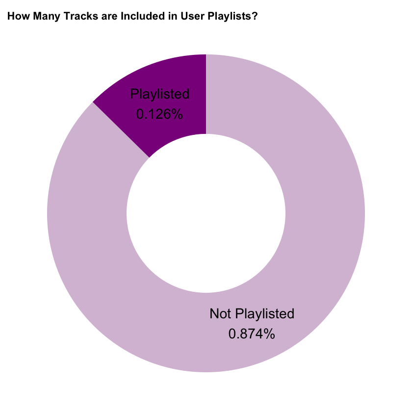
:::
::: {.column width="50%"}
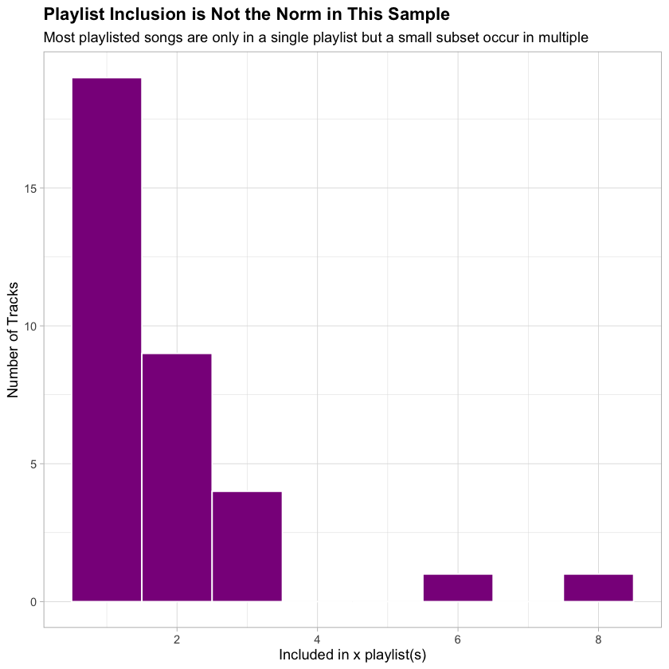
:::
::::

From  the sample of [**269**]{style="color: #86B35D;"} songs we are observing, playlist inclusion is relatively rare. Only [**34**]{style="color: #86B35D;"} songs ([**~13%**]{style="color: #86B35D;"}) were found on at least one user playlists on the observation date. This highlights that playlist exposure is not the norm for most tracks. Of the tracks included in playlists, inclusion is not uniform. While it is most common for that track to be included in only a single playlist, there are a number of exposed tracks that occur in multiple playlists, suggesting there may be certain qualities that influence exposure intensity.

## Engagement Differences At A Glance

### Track Popularity

Track popularity varies widely across the full sample, reflecting a mixture of niche and highly popular releases. Between the two groups (those with playlist exposure and those without playlist exposure), the tracks with playlist exposure have a higher mean.

:::: {.columns style="gap: 1rem;"}
::: {.column width="50%"}
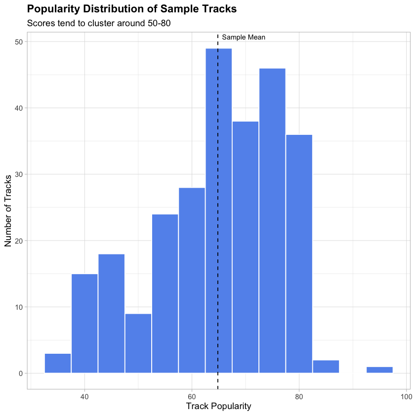
:::
::: {.column width="50%"}
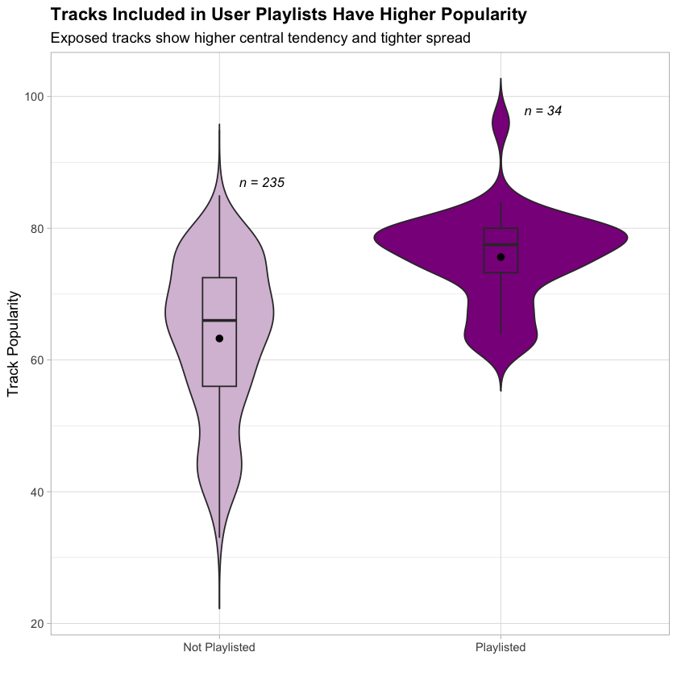
:::
::::

Tracks included in user playlists show a much higher central tendency and reduced variance. While non-playlisted tracks span a broad range of scores, those included in playlists cluster towards the upper end of the distribution, indicating that playlist exposure is concentrated among high-engagement songs.

As track listening patterns and listening recency are both major factors in Spotify’s algorithm to calculate the popularity score, this factor will likely have one of the strongest effects on playlist exposure, a hypothesis later confirmed in the results. Given that track popularity is partially driven by artist-level engagement, another question to consider is whether playlist exposure reflects artist stature more broadly.

### Who Gets Added to The Playlist?

#### By Company

The very system that produces and manages k-pop idols has grown and become very complicated in recent years. The Hallyu Wave across the world has inspired a global fascination with Korean culture and thus great investment into its pop culture. With that great wealth resulting in both market consolidation and portfolio diversification, 4 major companies dominate the idol market: SM Entertainment, YG Entertainment, JYP Entertainment, and HYBE. These companies are informally known as “The Big 4”. For the purposes of this analysis, a Big 4 group is defined as a group claimed by one of the major players, regardless of subsidiary management.

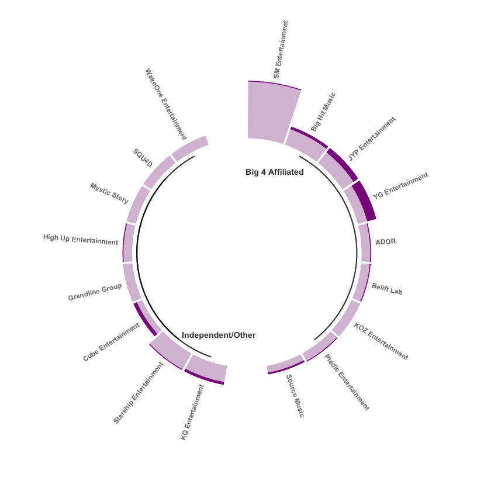{width=80%}

:::: {.columns style="gap: 1rem;"}
::: {.column width="50%"}
(Often these are subsidiaries that give up independent power in exchange for resources.) If the subsidiary label has independent decision-making power, the group is not considered part of the Big 4. In the sample, [**59.5%**]{style="color: #86B35D;"} of groups ([**16**]{style="color: #86B35D;"}) are claimed by a Big 4 Company. Of those groups, [**14.4%**]{style="color: #86B35D;"} of their tracks are included in playlists. Of the groups not associated with a Big 4 or whose management operates independently of a Big 4, about [**10.1%**]{style="color: #86B35D;"} of their tracks end up user playlists.  While the difference is small, it suggests that institutional visibility may provide a marginal advantage.
:::
::: {.column width="50%"}
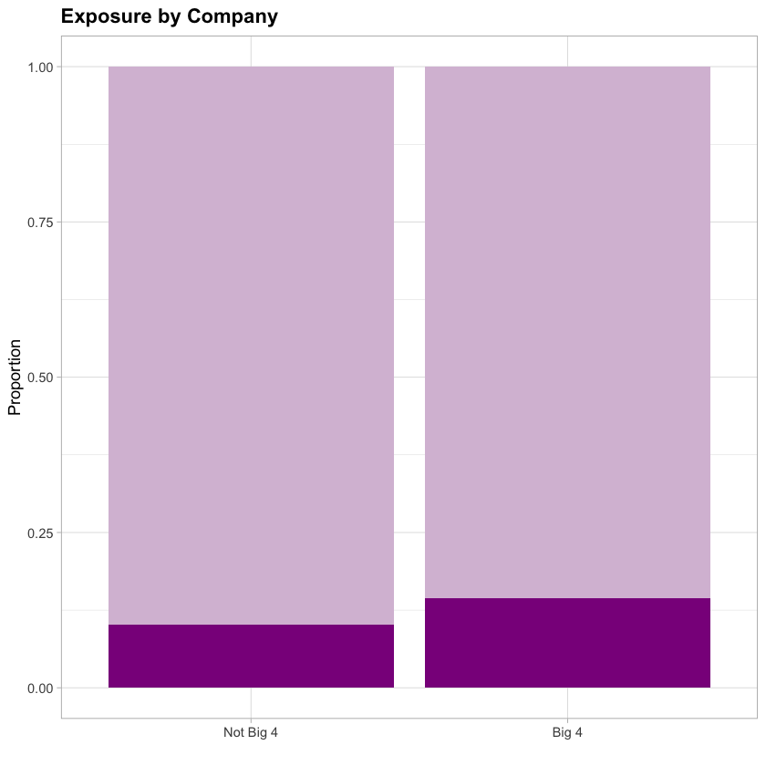
:::
::::

#### By Gender

:::: {.columns style="gap: 1rem;"}
::: {.column width="50%"}
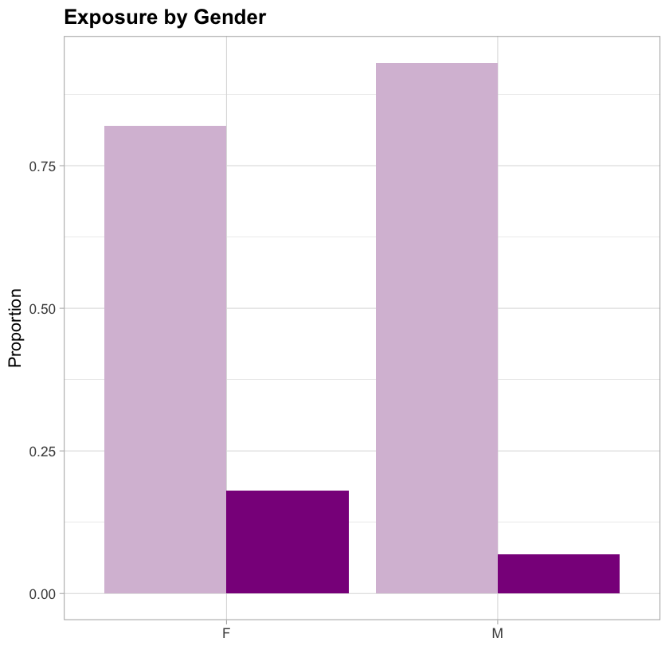
:::
::: {.column width="50%"}
As referenced earlier, gender is relatively balanced in this sample. Girl Groups make up [**51.7%**]{style="color: #86B35D;"} of the sample (boy groups [**48.3%**]{style="color: #86B35D;"}). Market-wise, boy groups usually have higher album sales and larger scale world tours while girl groups frequent Korean music charts and are more popular with the general Korean public. Music-wise, girl groups and boy groups release different styles of music in order to appeal to their target demographics. In spite of all this, with the ongoing evolution of society at large, girl groups have risen in their global appeal like *Blackpink* and *New Jeans*.
:::
::::

The increased appeal may be what is being observed in the plot above where [**18.0%**]{style="color: #86B35D;"} of sampled girl groups have a track featured on a playlist while only [**6.9%**]{style="color: #86B35D;"} of sampled boy groups have a track featured on a user playlist. This difference motivates the inclusion of gender as a structural control in later models. 

### Is Exposure Just Age and Fame?

#### By Artist Popularity

K-pop in comparison to other genres is pretty famous for very loyal fandoms (a good comparison would be Taylor Swift’s Swifties.) As such dedication is vital to revenue growth for management companies (loyal fans participate in intensive purchasing of albums, merch, and tickets along with paid access for ‘closeness’ to idols through exclusive content and events.) As a result, loyal fandoms can significantly influence listening behavior of tracks, regardless of their quality.

:::: {.columns style="gap: 1rem;" }
::: {.column width="50%"}
There is an expectation given that artist_popularity and popularity are so strongly correlated (track popularity is also used to help calculate artist popularity) that we will see similar behavior when comparing playlist exposure groups. To some extent, this is true. The average artist popularity for those included in a user playlist is about [**80**]{style="color: #86B35D;"}. The average artist popularity for those not included in a playlist is [**70**]{style="color: #86B35D;"}. This difference though is likely the result of a large proportion of playlisted tracks with artist popularity scores of about [**85**]{style="color: #86B35D;"}. 
:::
::: {.column width="50%"}
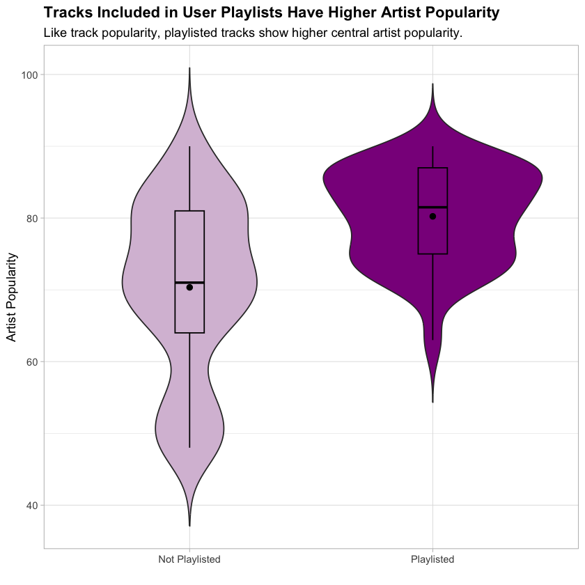
:::
::::

#### By Age

:::: {.columns style="display: flex; gap: 1rem;"}
::: {.column width="50%"}
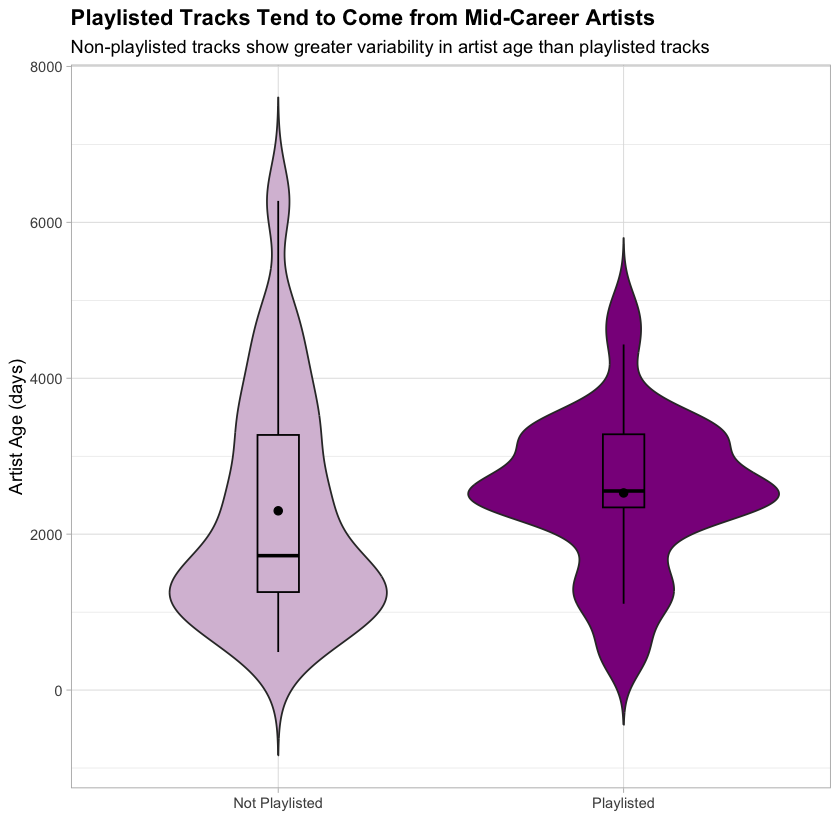
:::
::: {.column width="50%"}
When looking at how long the artist has been active (age_days) and playlist exposure, there is a possibility that we are also looking at the influence of artist popularity as well. As it often takes time for groups to build up their cult followings or to hit their success point, younger groups are often at a disadvantage when it comes to engagement. But older groups may also have difficulty as they do not release music as frequently and may be overlooked by fans in favor of more recent debuts. 
:::
::::

As noted in the plot above, tracks included in playlists come from groups with a median age of  [**2554**]{style="color: #86B35D;"} days ([**~7 years**]{style="color: #86B35D;"}). While those not included in a playlist have a median age of  [**1724**]{style="color: #86B35D;"} days ([**~4.7 years**]{style="color: #86B35D;"}). Funnily enough, most groups sign an initial 7 year contract with their companies when debuting. It is a common point for groups to disband or to split up.

### Maybe it was Just the Track?

#### By Recency
One feature that may influence playlist exposure may be how recently a track was released. In K-Pop, the month or so following the release of a single or album is filled with promotions on social media, music shows, etc. All in the hopes of generating listens and increasing album sales. From the sample, average track age does not differ significantly by playlist exposure. However the more concentrated distribution among playlisted tracks suggests a mild preference for more recent increases.

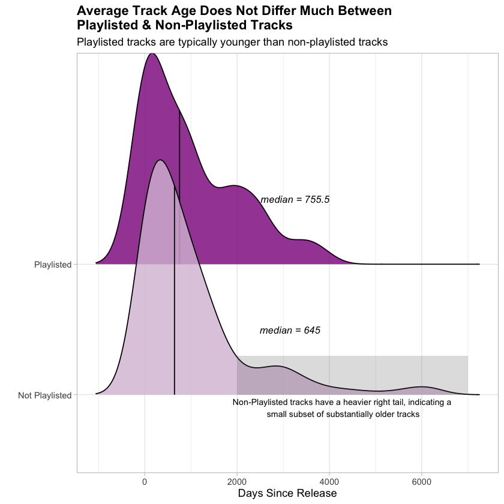{width=80%}

#### By Duration
:::: {.columns style="gap: 1rem;"}
::: {.column width="50%"}
The average charting song on Spotify in 2024 was about 3 minutes, 15 seconds shorter than the average song in 2023. The shortening of charting songs in recent years is seen as the result of changes in songwriting, listening technology, and even genre. Hip-hop and pop tracks are shorter in nature than ballads. In our data, a majority of tracks range from [**2.5 minutes**]{style="color: #86B35D;"} (150,000 ms) to [**3.33 minutes**]{style="color: #86B35D;"} (250,000 ms). Even the most popular songs in our sample fall mostly into this range. Track length shows little difference between playlisted and non-playlisted tracks, suggesting that song length alone is not a meaningful driver of playlist inclusion within this genre.
:::
::: {.column width="50%"}
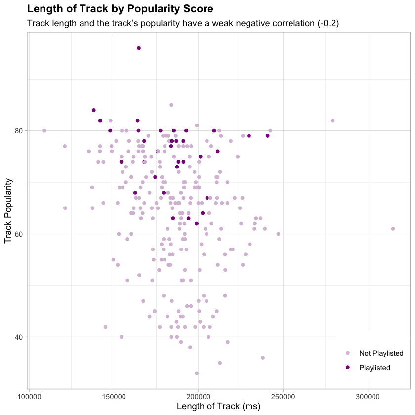
:::
::::

::: {.callout-tip icon="false"}

## 🎤 In Brief

- Playlisted tracks are substantially more popular than non-playlisted tracks
- Artist Popularity mirrors this sentiment, likely due to overlap
- Big 4 affiliation and gender show modest but consistent differences
- Track length and release recency appear weakly related to playlist exposure

*These patterns prove that there is a need to disentangle whether playlist inclusion drives popularity or simply reflects pre-existing engagement.*
:::

# What Features (if any) Contribute to the Likelihood of Being Included on a User Curated Playlist?

As user playlists play a central role in music discovery, companies are more interested than ever in understanding which track and artist characteristics are associated with playlist inclusion. To answer this, we’ll turn to logistic regression. From the given data, I have chosen to focus specifically on features like `duration_ms`, `popularity`, `artist_followers` , `artist_popularity`, `big4` , `gender` , `days_since_release` , `age_days` , `collab` , `genre_noise_music` , and `genre_k_rock` .  

From this, I estimate three complementary models:

::: {.callout-tip icon="false"}
## 🎤 Models

1. A ***baseline logistic regression model*** for interpretability and controlling confounding variables
2. A ***standardized logistic regression*** to compare relative effect sizes on a common scale
3. An ***elastic net model*** to assess robustness and generalization under regularization

:::

Model performance is evaluated using AUC. Given the small sample size, AUC is primarily used for comparison purposes rather than performance evaluation.

## Model A: Baseline (AUC= 0.6778)

All relevant track and artist features were retained in the baseline logistic regression model to ensure interpretability and control for potential confounding, even if some predictors were not statistically significant individually. Sparse features like genre_k_rock are noted with caution.

| **Variable** | **Log-Odds Estimate** | **Odds** |
| --- | --- | --- |
| `duration_ms` | -2.587e-06 | 0.9999 |
| `popularity` * | 4.049e-01 | 1.4991 |
| `artist_followers` | 8.544e-09 | 1.0000 |
| `artist_popularity`* | -1.571e-01 | 0.8546 |
| `big4` (1)* | -1.514 | 0.2201 |
| `gender`(M)* | -1.778 | 0.1689 |
| `days_since_release` | -1.470e-04 | 0.9999 |
| `age_days` * | 8.713e-04 | 1.0009 |
| `collab` (1) | 7.453e-01 | 2.1070 |
| `genre_noise_music` (1) | -3.482e-02 | 0.9658 |
| `genre_k_rock` (1) | -9.451 | 7.8583e-05 |

Key drivers of playlist inclusion appear to be track popularity, collaboration tracks, Big 4 company status, and group gender. 

- Track popularity has the strongest positive association with playlist inclusion
    
    > *For a 1 unit increase in popularity, the odds of being included on a user curated playlist increases by [**~50%**]{style="color: #86B35D;"}*
    
- Tracks from girl groups and non- Big 4 companies have higher odds in appearing in user playlists
    
    > *While tracks associated with Big 4 Companies occur more frequently in user playlists overall, when controlling for all the benefits that Big 4 affiliation provides like artist reach, Big 4 affiliation itself is associated with lower odds of playlist inclusion. This suggests that user curated playlists may favor independent or discovery oriented tracks, once visibility is accounted for.*
    
- Collaborations are associated with much larger odds of being included in a playlist
- Track length, recency, and genre have only minimal effects after controlling for engagement and Artist features.

## Model B: Standardized Logistic Regression 

:::: {.columns style="gap: 1rem;"}
::: {.column width="55%"}
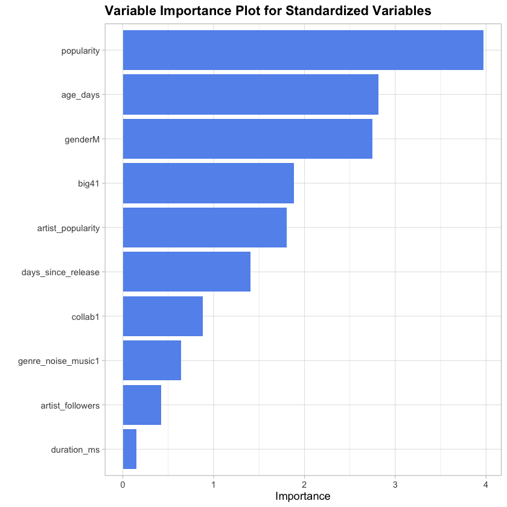
:::
::: {.column width="45%"}
To compare features on a common scale, continuous variables are transformed logarithmically and all numeric variables are standardized.  The standardized coefficients are not useful for direct odds interpretation, but instead for relative importance comparison. 

- The variable importance plot, to the right, show that track popularity, group age, gender, Big 4 membership,  and artist popularity contribute the strongest standardized effects.
- Model B’s results largely reinforce the conclusions from the initial model.
:::
::::

## Model C: Elastic Net  Model (AUC=0.7264)

:::: {.columns style="gap: 1rem;"}
::: {.column width="45%"}
Elastic Net regression confirms that `popularity`, `artist_followers`, `big4` , `gender` , `age_days` , and `collab` are the most stable under regularization, while features like `duration_ms`and sparse genre indicators are largely penalized out. 

Notably, `artist_popularity`, a feature considered significant in the previous 2 models is dropped. This suggests that `artist_popularity` ’s significance may be redundant compared to more granular engagement metrics like `artist_followers`, track popularity, or track features like `collab` .
:::
:::{.column width="55%"}
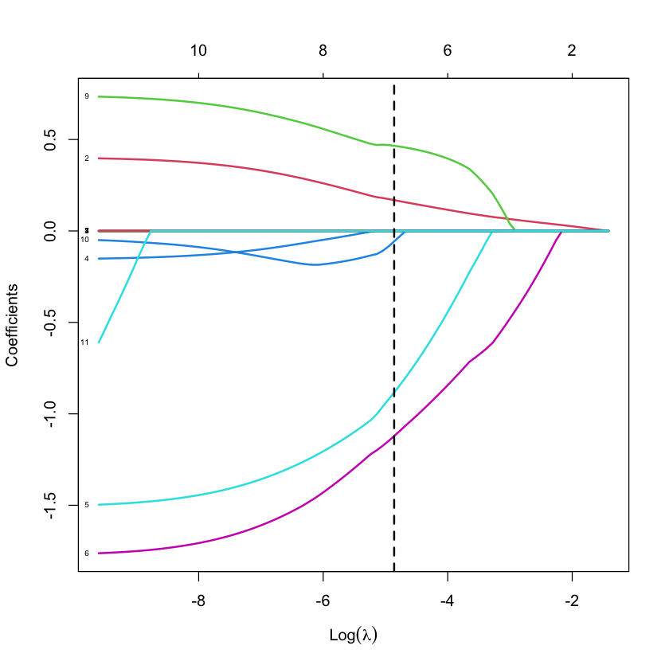
:::
::::

| Variable | Penalized Coefficient |
| --- | --- |
| `popularity` | 1.113506e-01 |
| `artist_followers` | 8.149439e-09 |
| `big4` (1) | -4.013700e-01 |
| `gender` (M) | -8.182169e-01 |
| `age_days` | 6.686525e-05 |
| `collab` (1) | 3.864981e-01 |

::: {.callout-tip icon="false"}
## 🎤 In Brief

*Overall, observable engagement metrics and structural attributes, rather than composite popularity scores, provide the most robust signal for playlist inclusion.*

:::

# Do Engagement  Differences Survive After Controlling for Track Characteristics?

Having figured out which signals predict playlist inclusion, the next question is whether playlisted tracks truly differ in engagement after accounting for those same signals. As Spotify’s track popularity is calculated algorithmically, including both listening volume and recency, it’s important to differentiate between differences in actual popularity and the differences that continue once baseline artist and track characteristics are held constant. 

To address this, I estimate regression-adjusted models of track popularity, treating playlist exposure as the main predictor while controlling for track and artist features.

## Regression Adjustment

This approach adjusts for confounding variables like group age, company affiliation, and track recency, allowing for a more meaningful comparison between playlisted and non-playlisted tracks.  Artist popularity will be excluded from this model, as track popularity is often incorporated in its calculation. 

Including all these confounders increases the model’s explanatory power: the adjusted $R^2$ grows from [**0.1122**]{style="color: #86B35D;"} , in the unadjusted version, to [**0.5084**]{style="color: #86B35D;"}, in the fully adjusted version. This suggests that much of the variation in track popularity is explained by structural and content-related features, rather than playlist exposure alone. Even after adjustment, playlist exposure continues to be statistically significant in predicting track popularity, as is track length, artist followers, Big 4 affiliation, and gender.

| Variable | Coefficient |
| --- | --- |
| `playlist_exposure` | 6.917 |
| `duration_ms` | -1.308e-04 |
| `artist_followers` | 2.332e-07 |
| `big4` | 1.049e+01 |
| `gender` | -3.056 |
| `days_since_release` | 1.456e-04 |
| `age_days` | 3.341e-05 |
| `collab` | 1.241 |
| `genre_noise_music` | 2.359e-01 |
| `genre_k_rock` | -4.549 |

:::: {.columns style="gap: 1rem;"}
::: {.column width="50%"}
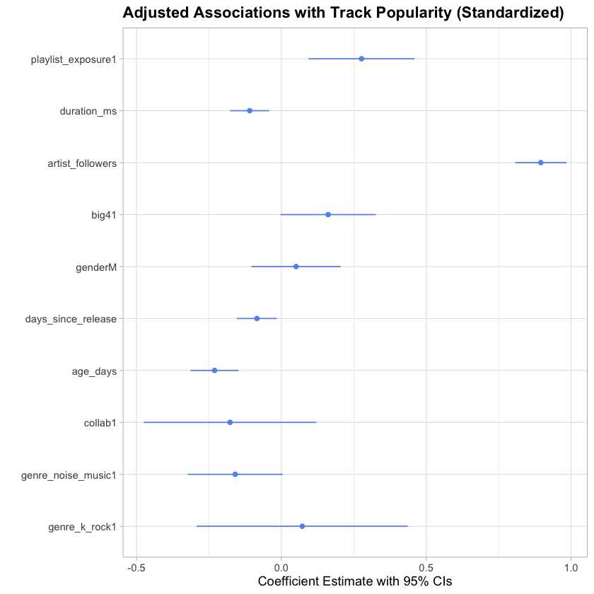
:::
:::{.column width="50%"}
To better compare all the features , I standardized all numeric variables and transformed all continuous variables. The standardized estimates (left) show that playlist exposure continues to be significant, along with `duration_ms`, `artist_followers` , `big4` , `days_since_release` , `age_days` , and `genre_noise_music` .

The magnitudes of the coefficients show that playlist exposure explains incremental engagement differences, rather than dominating the popularity signal. Suggesting that playlist inclusion is only associated with track engagement and does not determine it.
:::
::::

::: {.callout-tip icon="false"}

## 🎤 In Brief
*Playlist inclusion and popularity reinforce one another and are likely to be influenced by unobserved promotional, social, and algorithmic mechanisms.*
:::

# Conclusion

This analysis examined how engagement, artist, and track characteristics relate to user playlist curation from one of the most experimental and strictly managed genres in modern music. Rather than assuming that playlist exposure is caused by engagement, I modeled it in both directions: first, to understand what characteristics help predict playlist exposure through logistic regression and second, whether engagement differences continue after applying a regression adjustment framework controlling for those same characteristics.

The results showed that while the composite track popularity was the strongest predictor of playlist exposure, it does not fully determine it. Even after adjustment, it becomes clear that playlist inclusion and popularity are closely related and likely influenced by unobserved mechanisms.

## Key Takeaways:

- Playlist inclusion is relatively rare (only 13% of the sample), but is concentrated among tracks with high popularity scores.
- Track popularity is a strong predictor of inclusion, but does not fully explain engagement differences.
- Even after controlling for available track and artist features, playlisted tracks show higher engagement.
- Big 4 affiliation and gender show consistent associations even after adjustment, suggesting the influence of structural dynamics beyond content.
- Playlist inclusion and popularity reinforce one another and are likely to be influenced by unobserved promotional, social, and algorithmic mechanisms.
- Findings provide a framework for operationalizing content discovery signals to inform platform strategy, recommendation optimization, and audience development decisions.

## Limitations & Future Directions

Although this analysis was able to examine the relationship between observable signals and playlist inclusion, some limitations need to be addressed. First, is the scale of the sample. The gathered data is from a singular day in 2025 and covers a limited set of groups. This restricted the ability to see how engagement may have changed from first release to after playlist inclusion and how it may have continued to change throughout the course of its existence. As a result, this analysis focused on patterns of exposure and engagement rather than causal inference.

Second, is how platform opacity restricts feature availability. One of the key discoveries from feature importance emphasized how composite popularity scores are a less robust signal than engagement metrics and structural attributes of tracks. Spotify does not release data about listening volume, a key factor only mentioned in the track popularity algorithm documentation. Spotify has also deprecated developer access to track features like valence (music positiveness) and danceability along with visibility into official *Spotify* playlists. Given the stylistic diversity of K-pop (bubble gum pop to reggaeton to disco), the inclusion of track features such as these could have enhanced vision into track characteristics as a result of structural dynamics. Future work could also compare the differences between professionally curated playlists and user curated playlists, in an effort to further individual discovery behavior from platform-driven exposure.

Overall, this analysis provides a framework for examining how observable engagement and structural signals interact within platform algorithms. While exploratory, it sets a basis for future work ranging from longitudinal study to experiments that further disentangle causality between exposure and engagement. These signals could also be operationalized through monitoring and dashboards of the ongoing measurement of key discovery signals for stakeholder use in data-driven decision-making.